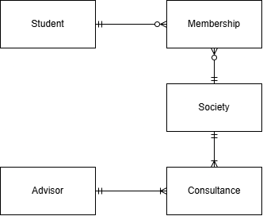
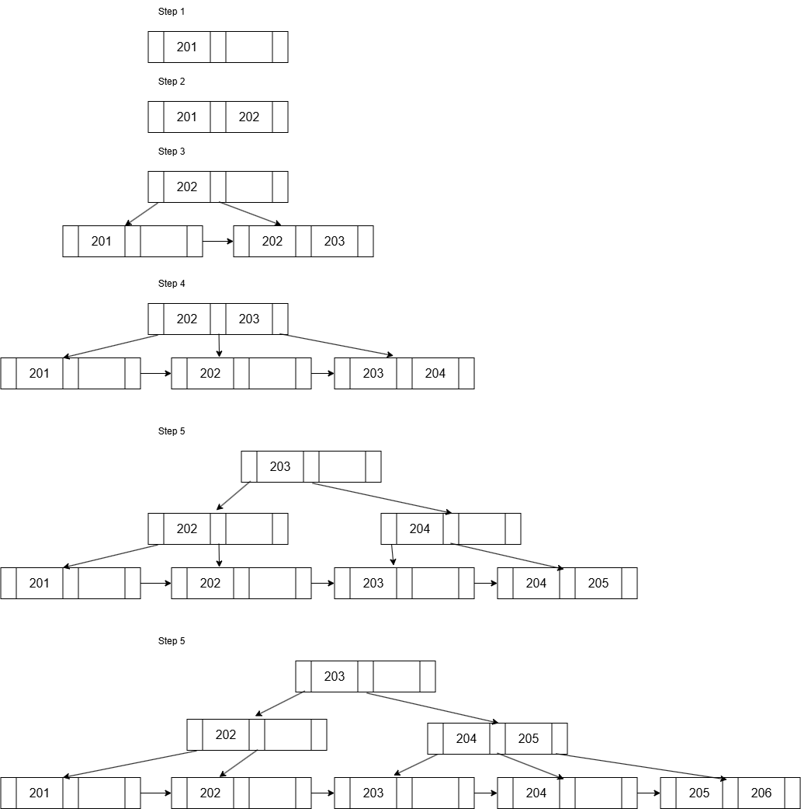
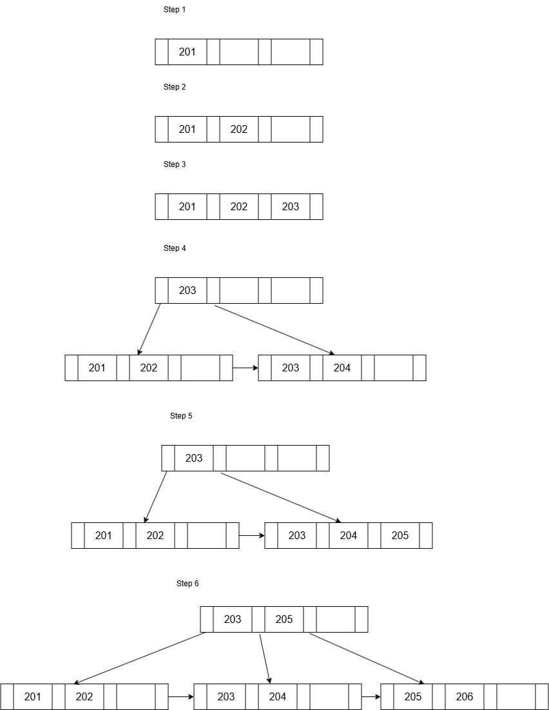

# 2026 JAN Exam

[Link to the paper](https://eprints.tarc.edu.my/35828/1/BMCS3183.pdf)

- [2026 JAN Exam](#2026-jan-exam)
  - [Question 1](#question-1)
  - [Question 2](#question-2)
  - [Question 3](#question-3)
  - [Question 4](#question-4)

## Question 1

a)

|            | Quantitative                                                                         | Qualitative                                                    |
| ---------- | ------------------------------------------------------------------------------------ | -------------------------------------------------------------- |
| Definition | Data that can be measured and expressed numerically.                                 | Data that is descriptive and conceptual.                       |
| Examples   | 5 units in 1 package, RM12.00 per package, weight for each apple within 200g to 250g | red organic apple, import from California, USA, taste is sweet |

b)

- Transaction Processing Monitor is a program that controls data transfer between the client and server, which sites between the client and servers' services.
- It handle the service cals from the client and forward the request to the appropriate server, and then return the results back to the client.
- TPM functions includes routing transaction requests, manage distributed transactions, load balancing, increase reliability, and funneling.

c)



- One student can join zero or many societies, and one society can have zero or many students.
- One advisor can advise one or many societies, and one society can have one or many advisors.

## Question 2

a)

i)

$\Pi_\text{ComID, ComName, ComAddress, ComContactPerson, ComContactNo} (\sigma_{\text{ComAddress LIKE '\\%Malaysia\\%'} \wedge \text{Industry = 'Banking'}} (\text{Company}))$

ii)

$\Pi_\text{StuID, StuName, StuContact} (\sigma_{\text{StuSex = 'F'}\wedge\text{Cohort = '202505'}} (\text{Student}))$

iii)

$\Pi_\text{ComID, StuId, StartDate, EndDate, InternshipFee} (\sigma_{\text{StartDate} \geq \text{2025/01/01} \wedge \text{EndDate} \leq \text{2025/12/31}} (\text{InternshipPlacement}))\bowtie_\text{InternshipPlacement.ComID = Company.ComID} (\sigma_\text{ComName = 'Petronas'}(\text{Company}))$

iv)

$\Pi_\text{ProgID, ProgName} (\text{Programme}) \bowtie_\text{Programme.ProgID = Student.ProgID} (\text{Student})\bowtie_\text{Student.StuID = InternshipPlacement.StuID} J_\text{COUNT StuID, SUM InternshipFee} (\text{InternshipPlacement})$

b)

i)

```sql
GRANT SELECT(ComID, ComName, ComAddress, ComContactNo)
ON Company
TO PUBLIC;

GRANT UPDATE(ComAddress, ComContactNo)
ON Company
TO Alice;
```

ii)

```sql
GRANT ALL PRIVILEGES
ON Company
TO Julia
WITH GRANT OPTION;
```

iii)

```sql
REVOKE ALL PRIVILEGES
ON Company
FROM Raymond;
```

## Question 3

a)

- 1NF
  - Original: OnlineFoodOrder(ResID, RestaurantName, CatID, CategoryName, CustID, CustName, CustContact, PlatID, PlatformName, OrderDate, Total, Discount, DeliveryCharge, FinalTotal)
  - Restaurant(<ins>ResID</ins>, RestaurantName, CatID, CategoryName)
  - OnlineFoodOrder(<ins>ResID\*</ins>, <ins>CustID</ins>, CustName, CustContact, PlatID, PlatformName, <ins>OrderDate</ins>, Total, Discount, DeliveryCharge, FinalTotal)
- 2NF
  - Partial dependencies: CustID → CustName, CustContact, PlatID, PlatformName
  - Restaurant(<ins>ResID</ins>, RestaurantName, CatID, CategoryName)
  - OnlineFoodOrder(<ins>ResID\*</ins>, <ins>CustID\*</ins>, <ins>OrderDate</ins>, Total, Discount, DeliveryCharge, FinalTotal)
  - Customer(<ins>CustID</ins>, CustName, CustContact, PlatID, PlatformName)
- 3NF
  - Transitive dependencies: CatID → CategoryName, PlatID → PlatformName
  - Restaurant(<ins>ResID</ins>, RestaurantName, CatID\*)
  - Category(<ins>CatID</ins>, CategoryName)
  - OnlineFoodOrder(<ins>ResID\*</ins>, <ins>CustID\*</ins>, <ins>OrderDate</ins>, Total, Discount, DeliveryCharge, FinalTotal)
  - Customer(<ins>CustID</ins>, CustName, CustContact, PlatID\*)
  - Platform(<ins>PlatID</ins>, PlatformName)

b)

| Anomaly Type         | Example                                                                                                                                                                  |
| -------------------- | ------------------------------------------------------------------------------------------------------------------------------------------------------------------------ |
| Insertion Anomaly    | It is not possible to add a customer unless the customer places an order.                                                                                                |
| Modification Anomaly | Changing the platform name for PlatID P201 requires updating all online food order records that reference P201, which can lead to inconsistencies if not done correctly. |
| Deletion Anomaly     | Deleting the customer C17668 will also wipe all data of the platform P208 from the database.                                                                             |

## Question 4

a)

i)



ii)



b)

- Database Distribution Plan is a strategic decision to determine how data is distributed across multiple sites in a distributed database system.
- Branch records are replicated since they can be used at any branches and rarely updated
- Item records are replicated since they can be used at any branches and rarely updated
- Staff records are partitioned since they only belong to one branch and each branch manages its own staff.
- Sales records are partitioned since they only belong to one branch and each branch manages its own sales.
