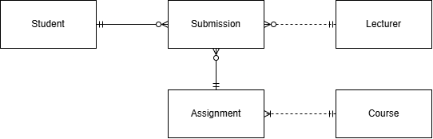
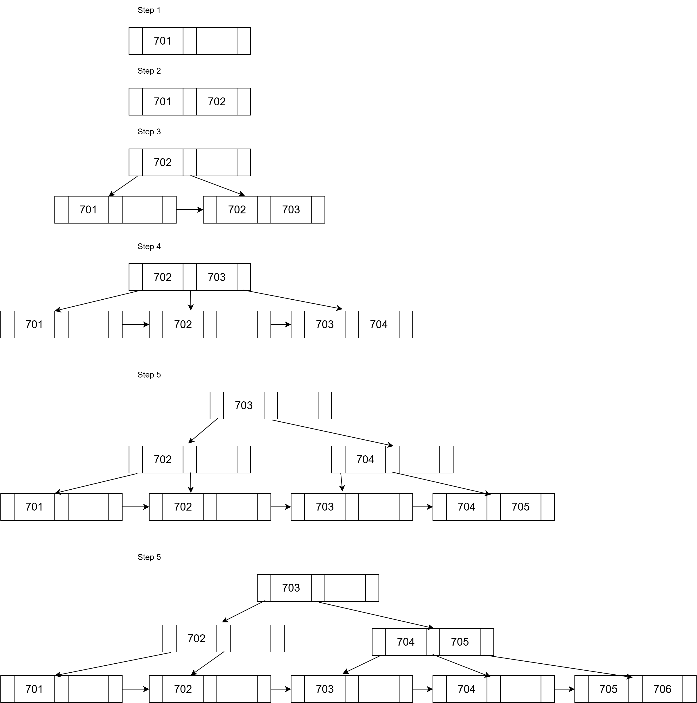
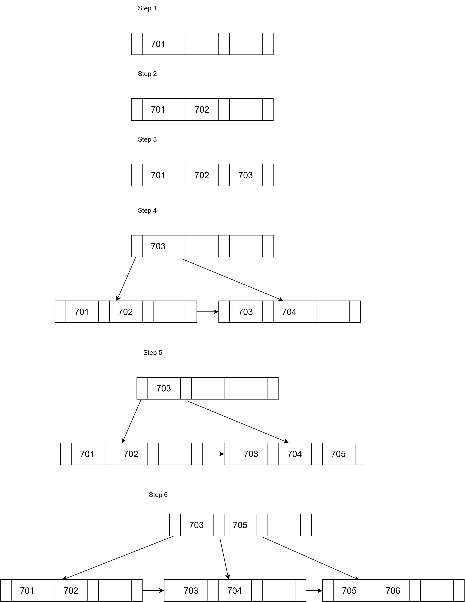
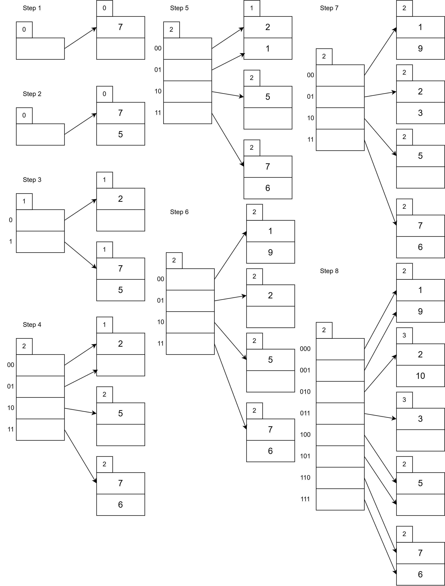

# 2026 MAY Exam

[Link to the paper](https://eprints.tarc.edu.my/37329/1/BMCS3183%20-%20QP.pdf)

- [2026 MAY Exam](#2026-may-exam)
  - [Question 1](#question-1)
  - [Question 2](#question-2)
  - [Question 3](#question-3)
  - [Question 4](#question-4)

## Question 1

a) Example using University Coffee Shop:

| Source    | Explanation                                                            | Example                                                          |
| --------- | ---------------------------------------------------------------------- | ---------------------------------------------------------------- |
| Primary   | Data that is collected directly from the original source.              | Customer feedback surveys of newly launched coffee.              |
| Secondary | Data that is collected from some party other than the original source. | Report from a market research firm on coffee consumption trends. |
| Internal  | Data that is collected from within the organization.                   | Daily sales receipts from the POS system of the coffee shop.     |
| External  | Data that is collected from outside the organization.                  | Social media reviews and ratings of the coffee shop.             |

b)

| Logical Data Independence                                                                                         | Physical Data Independence                                                                             |
| ----------------------------------------------------------------------------------------------------------------- | ------------------------------------------------------------------------------------------------------ |
| The ability to change the conceptual schema without having to change the external schema or application programs. | The ability to change the internal schema without having to change the conceptual schema.              |
| It allows users to access data without needing to know the details of how the data is stored.                     | It allows for changes in storage structures or access methods without affecting the conceptual schema. |

c)



- One student can make zero or many assignment submissions, and one assignment submission can be made by one and only one student.
- One lecturer can mark zero or many assignment submissions, and one assignment submission can be marked by one and only one lecturer.
- One assignment can have zero or many assignment submissions, and one assignment submission can be for one and only one assignment.
- One course can have one or many assignments, and one assignment can be for one and only one course.

## Question 2

a)

i) $\Pi_\text{CruiseID, CruiseName} (\sigma_{\text{CruiseTheme = 'Disney'} \vee \text{CruiseTheme = 'Marvel'}} (\text{Cruise}))$

ii) $\Pi_\text{CabinID, Capacity, Price} (\sigma_{\text{CabinType = 'Ocean View'} \wedge \text{Status = 'Available'}} (\text{Cabin}))$

iii)

$\Pi_\text{PassName, PassContact, PassGender} (\text{Passenger}) (\bowtie_\text{Passenger.PassNo = CabinBooking.PassNo} (\text{CabinBooking}) (\bowtie_\text{CabinBooking.PackageID = Package.PackageID}$

$(\sigma_{\text{DepartureDate} \geq \text{2026/06/01} \vee \text{DepartureDate} \leq \text{2026/06/30}} (\text{Package})) (\bowtie_\text{Package.CruiseID = Cruise.CruiseID} (\sigma_\text{CruiseName = 'Alaska Cruise'}(\text{Cruise})))))$

iv) $J_\text{COUNT PackageID}(\sigma_\text{DeparturePort LIKE '\\%Singapore\\%'}(\text{Package}))$

b)

i)

```SQL
GRANT SELECT
ON Cabin
TO PUBLIC;

GRANT UPDATE(Price)
ON Cabin
TO Gideon;
```

ii)

```SQL
GRANT ALL PRIVILEGES
ON Package
TO Jerald
WITH GRANT OPTION;
```

iii)

```SQL
REVOKE ALL PRIVILEGES
ON Package
FROM Danny;
```

## Question 3

a)

- 0NF
  - GymSession(MemID, MemName, MemContact, BranchID, BranchName, OrderDate, PackageID, PackageType, RatePerSession, TrainerID, TrainerName, NoOfSession, TotalFee)
- 1NF
  - Member(<ins>MemID</ins>, MemName, MemContact, BranchID, BranchName)
  - GymSession(<ins>MemID\*</ins>, <ins>OrderDate</ins>, <ins>PackageID</ins>, PackageType, RatePerSession, TrainerID, TrainerName, NoOfSession, TotalFee)
- 2NF
  - Member(<ins>MemID</ins>, MemName, MemContact, BranchID, BranchName)
  - GymSession(<ins>MemID\*</ins>, <ins>OrderDate</ins>, <ins>PackageID\*</ins>, NoOfSession, TotalFee)
  - Package(<ins>PackageID</ins>, PackageType, RatePerSession, TrainerID, TrainerName)
- 3NF
  - Member(<ins>MemID</ins>, MemName, MemContact, BranchID\*)
  - Branch(<ins>BranchID</ins>, BranchName)
  - GymSession(<ins>MemID\*</ins>, <ins>OrderDate</ins>, <ins>PackageID\*</ins>, NoOfSession, TotalFee)
  - Package(<ins>PackageID</ins>, PackageType, RatePerSession, TrainerID\*)
  - Trainer(<ins>TrainerID</ins>, TrainerName)

b)

| Anomaly Type         | Example                                                                                                                                                                |
| -------------------- | ---------------------------------------------------------------------------------------------------------------------------------------------------------------------- |
| Insertion Anomaly    | Adding a new member requires entering a branch and package, even if the member has not booked any sessions yet.                                                        |
| Modification Anomaly | Changing the rate per session for package PK01 requires updating all gym session records that reference PK01, which can lead to inconsistencies if not done correctly. |
| Deletion Anomaly     | Deleting the package PK04 will also wipe all data of member M507.                                                                                                      |

## Question 4

a)

i)



ii)



b)


