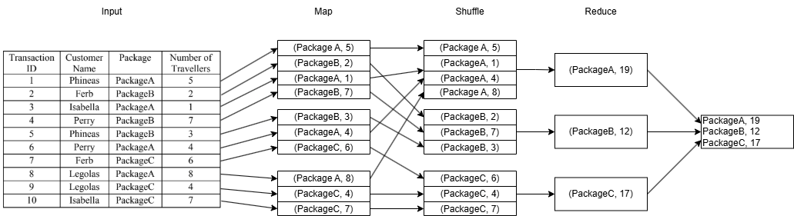
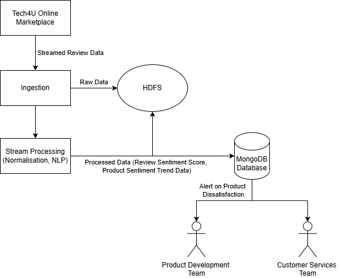
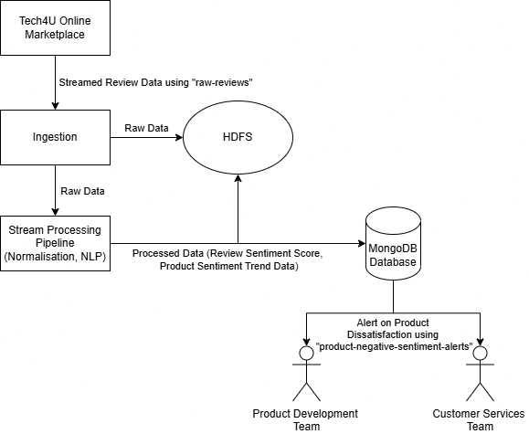
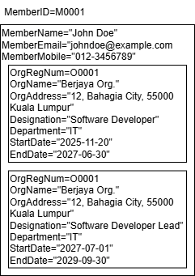
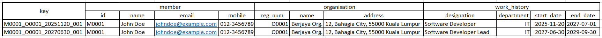

# 2024 June Exam

- [2024 June Exam](#2024-june-exam)
  - [Question 1](#question-1)
  - [Question 2](#question-2)
  - [Question 3](#question-3)
  - [Question 4](#question-4)

## Question 1

a)

i)

- Scale-up expands the capacity of an application by adding more resources (CPU, memory) to a single machine, while scale-out expands capacity by adding more machines to a cluster.
- Scale-up is limited by the maximum capacity of a single machine, while scale-out can potentially handle unlimited growth by adding more machines.
- For example, to increase the storage capacity of a database, scale-up would involve upgrading the existing server with more hard drives, while scale-out would involve adding more servers to the database cluster.

ii)

- Map function is responsible for processing input data and producing intermediate key-value pairs, while Reduce function takes the intermediate key-value pairs and combines them to produce the final output.
- Map function produces each key-value pair based on single input records, while Reduce function produces each key-value pair based on a set of intermediate key-value pairs with the same key.
- For example, in a word count application, the Map function would take each line of text as input and produce intermediate key-value pairs of (word, 1), while the Reduce function would take these intermediate key-value pairs and sum the counts for each word to produce the final output of (word, total count).

b)



## Question 2

a)

- Tech4U can employ spark structured streaming to perform sentiment analysis in real-time on the reviews posted by customers. Compared to historical analysis, real-time analysis allows Tech4U to quickly identify negative reviews on the product and take proactive measures to address customer concerns, such as offering refunds or improving the product.
- The primary data will be the customer reviews, which can be collected from the online platform where the product is sold. This data will be processed to identify negative sentiments using sentiment analysis techniques. The raw and processed data can be stored in sinks such as HDFS or NoSQL databases.
- The data is primarily used by the customer service team to monitor and respond to customer feedback in real-time, and by the product development team to identify areas for improvement based on customer sentiment.



b)

- Topic 1: "raw-reviews"
  - Message Content: {
      "review_id": "12345",
      "product_id": "67890",
      "customer_id": "54321",
      "review_text": "The button is not consistently responsive.",
      "timestamp": "2024-06-01T12:00:00Z"
  }
  - The topic will be subscribed by the data scientists for performing sentiment analysis and by the product development team for monitoring customer feedback on the product.
- Topic 2: "product-negative-sentiment-alerts"
  - Message Content: {
      "product_id": "67890",
      "negative_review_count": 5,
      "timestamp": "2024-06-01T12:05:00Z",
      "keyword": "unresponsive button"
    }
  - The topic will be subscribed by the customer service team for monitoring and responding to negative reviews, and by the product development team for identifying areas of improvement.



c)

- Anonymisation
  - Process of removing or masking personally identifiable information (PII) from the data to protect customer privacy. For example, replacing PII such as customer names and email addresses with pseudonyms or random identifiers in the reviews data to ensure that individual customers cannot be identified from the data.
  - This is important to ensure compliance with data protection regulations and minimise the risk of data breaches that could expose sensitive customer information.
- Strong Passwords
  - Use strong, unique passwords for all accounts that have access to the data pipeline, including database credentials and Kafka broker access. Use passphrase, which is sentences or combinations of words, as they are generally longer, more secure, and easier to remember than traditional passwords.
  - This is important to prevent unauthorized access to the data pipeline and protect sensitive customer data from being compromised by attackers who may attempt to guess or crack weak passwords.
- Access Control
  - Should practice Principle of Least Privilege (PoLP) by granting users and applications only the minimum level of access necessary to perform their tasks. For example, using Role-Based Access Control (RBAC) to restrict access of customer service team to only the "product-negative-sentiment-alerts".
  - This is important to limit the potential damage that could occur if an account is compromised, as attackers would only have access to a limited set of data and actions, reducing the risk of data breaches and unauthorized activities within the data pipeline.

## Question 3

a)

i)



ii)



b) Illustrate how replication is applied in the context of NoSQL databases to achieve fault-tolerance.

- Replication is a data redundancy technique that involves copying data across multiple nodes to ensure high availability and fault tolerance.
- In NoSQL databases such as MongoDB, replication is achieved through master-slave architecture, where one node acts as the primary (master) and the others act as secondary (slaves).
- The primary node handles all write operations and propagates changes to the secondary nodes.
- In the event of any node failure, the system can still read data from the remaining nodes, ensuring that the database remains available and operational.
- If the primary node fails, one of the secondary nodes can be promoted to become the new primary to maintain the continuity of write operations.

## Question 4

a)

```python
df.count()
```

b)

```python
df.show(5)
```

c)

```python
df.groupBy("Test").count()
```

d)

```python
df.filter(df["Assignment"] > 40)
```

e)

```python
df.sort(col("Assignment").desc())
```

f)

```python
def get_total_mark(test, assignment, presentation):
    return test + assignment + presentation

get_total_mark_udf = udf(get_total_mark, IntegerType())
```

g)

```python
df.withColumn("Total", get_total_mark_udf(col("Test"), col("Assignment"), col("Presentation")))
```
