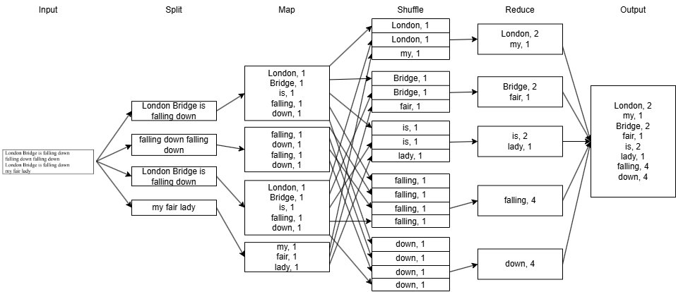
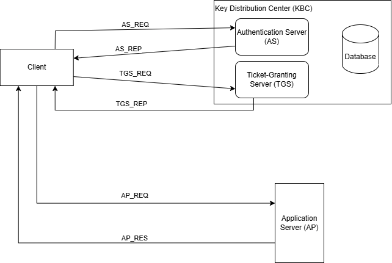

# 2024 November Exam

- [2024 November Exam](#2024-november-exam)
  - [Question 1](#question-1)
  - [Question 2](#question-2)
  - [Question 3](#question-3)
  - [Question 4](#question-4)

## Question 1

a) Detailed explanation of

- **Single mapper job**
  - Commonly used in transformation purposes, such as transforming the format of the data.
  - Pipeline only consists of: Single Input -> Single Mapper -> Single Output
  - Phase: Input, Split, Map, Output
  - Example: Lowercasing all the words in a text file.
  - Cannot perform aggregation or summarization tasks, as there is no reducer phase.
- **Multiple mapper reducer job**
  - Used for complex aggregation and summarization tasks, which requires joining multiple datasets.
  - Pipeline consists of: Multiple Inputs -> Multiple Mappers -> Reducer -> Single Output
  - Phases: Input, Split, Map, Partition (Shuffle, Sort), Reduce, Output
  - Example: Accumulate sales of each seller from product entity table (contains product and seller information) and product transaction table (contains product and transaction information).
    - Mappers emit seller, product, and sales to the reducer, which then aggregates the sales for each seller and outputs the total sales per seller.

b)



## Question 2

a)

```bash
hdfs dfs -mkdir data
```

b)

```bash
hdfs dfs -put ~/first_file.txt data/first_file.txt
```

c)

```bash
hdfs dfs -cp data/first_file.txt data/copy_of_first_file.txt
```

d)

```bash
hdfs dfs -mv data/copy_of_first_file.txt data/second_file.txt
```

e)

```bash
hdfs dfs -cat data/second_file.txt
```

f)

```bash
hdfs dfs -get data/second_file.txt ~/second_file.txt
```

g)

```bash
hdfs dfs -rm data/first_file.txt
```

h)

```bash
hdfs dfs -ls data
```

i)

```bash
hdfs dfs -rm -R data
```

## Question 3

a)

i)

- Event streaming is a continuous flow of individual events that record state changes, actions or occurrences.
- It is event-driven, meaning that it reacts to events as they happen, rather than waiting for a batch of data to be collected.
- It can handle unbounded data streams, allowing for real-time processing and analysis.
- It is commonly used in applications such as IoT devices for sensor events, or application logs for monitoring and alerting.

ii)

- Replication is the process of creating multiple copies, called replicas, of data across different nodes in a distributed system.
- In Hadoop, replication is used when storing data in HDFS.
- Replication factor indicates the number of copies of each data block that are stored across the cluster.
- This ensures fault tolerance and high availability, as if one node fails, the data can still be accessed from another node that has a replica, ensuring the system remains operational.

b)

- Traditional Database Management Systems are designed for structured data, which is stored in tables with fixed schemas, supporting ACID properties for transactions.
- NoSQL databases, on the other hand, are designed for unstructured or semi-structured data, and they do not require a fixed schema. They often prioritize scalability and performance over strict consistency, and they can handle large volumes of data across distributed clusters.

c)

i)

- Key-value data store can be used to cache the precomputed recommendations for each user, using the user ID as the key and the list of recommended movies as the value.
- This allows for fast retrieval of recommendations when a user logs in or requests their recommendations.
- It can be updated periodically as new recommendations are generated based on user interactions and preferences.
- This use case is justified because computing recommendations can be resource-intensive, caching helps to improve performance and user experience by providing quick access to recommendations.

ii)

- Document-based data store can be used to store user watch history logs, where each document represents a user's interactions with movies, including the movies they have watched, ratings given, and timestamps.
- This allows for flexible and dynamic storage of user data, which can be retrieved and analyzed to generate personalized recommendations based on user preferences and behavior.
- This use case is justified because user interactions schema design can change frequently depending on the features of the application, and document-based data stores provide the flexibility to accommodate these changes without requiring complex migrations.

## Question 4

a) Steps carried out when Spark job is submitted on a cluster:

- Job Submission: The user code is submitted to the Spark Driver, which is responsible for orchestrating the execution of the job.
- Resource Allocation: The Spark Driver requests resources from the cluster manager to execute the job. The cluster manager allocates resources (CPU, memory) for the Spark Executors according to the available resources and the job requirements.
- DAG Creation: The Spark Driver creates a Directed Acyclic Graph (DAG) of stages based on the transformations and actions defined in the user code. Each stage represents a set of tasks that can be executed in parallel.
- Task Execution: The Spark Driver sends tasks to the Spark Executors, which execute the tasks in parallel across the cluster. The results of the tasks are collected by the Spark Driver.

b)

i)

- Usable cores per node: 16 - 1 = 15
- Number of cores per executor: 5
- **Number of executors per node: 15 / 5 = 3**

ii)

- Memory allocated to YARN: 3 executors * 2 GB/executor = 6 GB
- Memory leftover: 128 GB - 6 GB = 122 GB
- **Amount of memory allocated to each executor: 122 GB / 3 executors = 40.6667 GB**

c)


