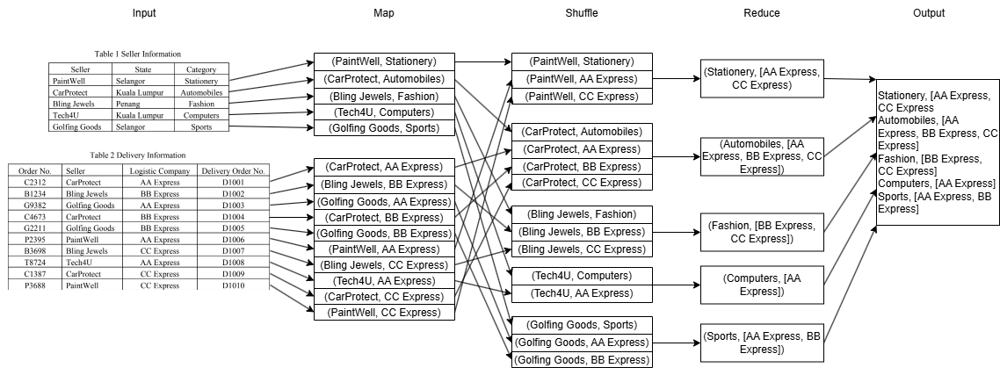
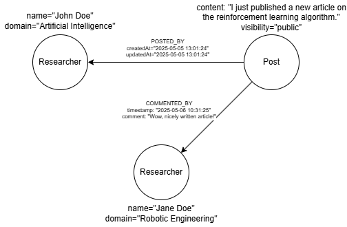

# 2024 October Exam

- [2024 October Exam](#2024-october-exam)
  - [Question 1](#question-1)
  - [Question 2](#question-2)
  - [Question 3](#question-3)
  - [Question 4](#question-4)

## Question 1

a)

- Record Reader is the component which reads the input data from the input source as records. After loading the input data, it splits the data into smaller chunks of typically 128MB. Each split will generate key-value pairs, which are then passed to individual mappers for processing. Splitting allows the map tasks to be distributed across the cluster, enabling parallel processing and improving performance.
- Combiner is the optional component that performs local reduction on the mapper output before it is distributed to the reducers. It takes the intermediate key-value pairs produced by the mappers and applies a reduce function to combine values with the same key in the small scope of the mapper node. This helps to reduce the disk I/O and network I/O during the shuffle phase, as it minimizes the amount of data that needs to be transferred to the reducers. The combiner is typically used when the reduce function is commutative and associative, allowing for partial aggregation of data before it reaches the reducers.

b)



## Question 2

a) Researcher, Post

b)

- Researcher: name, domain
- Post: content, visibility

c) POSTED_BY, COMMENTED_BY

d)

- POSTED_BY: createdAt, updatedAt
- COMMENTED_BY: comment, timestamp

e)



f)

- Graph databases are faster for querying complex relationships between entities, such as finding followers of a user or mutual friends, as they are designed to efficiently traverse relationships. Document databases may require multiple joins or complex queries to achieve the same result, which can be slower.
- Graph databases model data in a way that closely resembles real-world relationships, making it easier to represent and query social media data. Document databases may require more complex data modeling and may not be as intuitive for representing relationships between users, posts, and interactions.

## Question 3

a)

i)

- Input data for batch processing is bounded and static, while input data for stream processing is unbounded and continuously generated.
- Input data for batch processing is typically stored in files or databases, while input data for stream processing is generated in real-time from sources such as sensors, social media feeds, or log files.

ii)

- Batch processing: Aggregate most popular topics for every week grouped by domain, which can be emailed to researchers as a weekly newsletter.
- Stream processing: Real-time identification of hot topics or trending posts, which can be recommended to relevant researchers as they are happening, allowing them to stay updated with the latest trends in their field of interest.

b)

- "research-uploads"
  - Example message: {"uploadId": "456", "researcherId": "user1", "fileUrl": "<https://example.com/research.pdf>", "uploadedAt": "2024-10-01T10:00:00Z"}
  - Subscribers: Followers of the researcher, who will receive notifications about new research uploads.
- "citation-updates"
  - Example message: { "source_paper_id": "55", "cited_paper_id": "22", "citing_author": "Dr. Smith", "date": "2026-05-08" }
  - Subscribers: Researchers whose work was cited, allowing them to track their impact metrics in real-time.

c) Explain the following terms in Kerberos authentication protocol, explain key concepts and provide example in context of Hadoop:

- **Principal**: A principal is a unique identity which can be a user or a service in the Kerberos authentication protocol, represented as a string in the format `name@REALM`. For example, a user named "<student@EXAMPLE.COM>" is a principal representing the user "student" in the realm "EXAMPLE.COM".
- **Authentication Server**: The Authentication Server (AS) is a component in the Key Distribution Center (KDC) that verifies the identity of the principal by issuing a Ticket Granting Ticket (TGT) encrypted with the principal's password, using data from the Kerberos database. For example, when "<student@EXAMPLE.COM>" attempts to use "hdfs" service, they need to acquire a TGT from the AS by providing their credentials to authenticate themselves.
- **Ticket**: Tickets are encrypted data structures which used by the entity to access services. Tickets available in two types: Ticket Granting Ticket (TGT), which is issued by the AS for authentication purposes, and Service Ticket (ST), which is issued by the Ticket Granting Server (TGS) for accessing specific services. For example, after "<student@EXAMPLE.COM>" successfully authenticates with the AS and receives a TGT, they can use that TGT to request a ST for the "hdfs" service from the TGS, allowing them to access the HFDS service securely without needing to re-enter their password.

## Question 4

a)

```python
lines_rdd = sc.textFile("data.txt")
print(lines_rdd.collect())
```

b)

```python
words_rdd = lines_rdd.flatMap(lambda line: line.split())
```

c)

```python
word_count_rdd = words_rdd.map(lambda word: (word, 1)).reduceByKey(lambda a, b: a + b)
```

d)

```python
sorted_word_count_rdd = word_count_rdd.sortBy(lambda x: x[1], ascending=False)
```

e)

```python
p_words_rdd = words_rdd.filter(lambda word: "p" in word).distinct()
```
