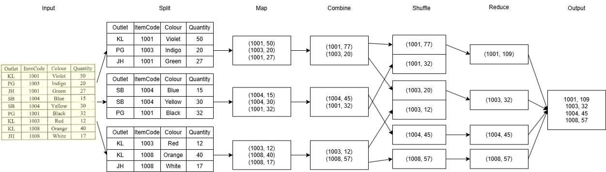
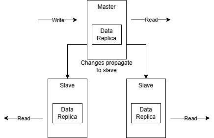
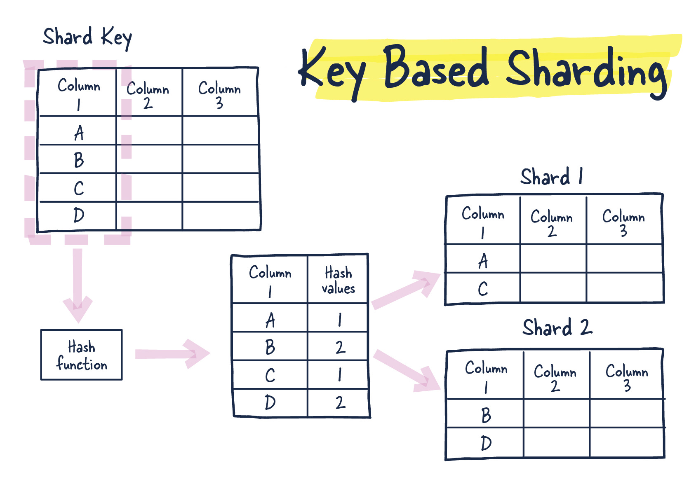

# 2025 January Exam

## Question 1

a)

- **Split**: Input data is split into smaller chunks, which are processed in parallel by the mappers. This allows for efficient processing of large datasets.
- **Map**: Each mapper processes a chunk of data and produces intermediate key-value pairs. The map function is applied to each input record, and the output is a set of key-value pairs.
- **Shuffle**: The intermediate key-value pairs are distributed across Reducers, pairs with the same key are sent to the same Reducer.
- **Sort**: The intermediate key-value pairs are sorted by key to group the same keys together.
- **Reduce**: Each Reducer merges the values associated with the same key using reduce function to produce a single output value for each key.

b)



- Combiner is used to perform a local reduce on each mapper's output before sending it to the reducers. This reduces the amount of intermediate data that needs to be transferred across the network, improving efficiency.
- In the diagram, there are only 6 pairs of intermediate key-value pairs needs to be shuffled instead of 9 pairs without the combiner.

## Question 2

a)

i)

- Key-value data store can be used to store the abbreviation as key and the full form as value.
- This allows for fast retrieval of the full form based on the abbreviation, which is useful for NLP's text normalization.
- For example, we can store "ASAP" as key and "as soon as possible" as value. When we encounter "ASAP" in the text, we can quickly look up the full form using the key-value data store and replace it in the text.

ii)

- Document data store can handle unstructured or semi-structured data, which is common in NLP projects where the input data may not have a fixed schema.
- This allows for flexibility in storing and processing data with varying attributes, such as different types of text data (e.g., tweets, articles, reviews) that may have different fields.
- If traditional relational databases were used, it would require a predefined schema and may not be able to accommodate the varying data structures, leading to intense data transformation or frequent database migrations.

b)

- Replication



- Sharding



## Question 3

a)

- One of the security vulnerabilities in Hadoop is human error.
- Employees may unintentionally expose sensitive data or misconfigure security settings, leading to potential breaches.
- Employee training and awareness educates staff on the importance of security best practices, such as strong password policies, recognizing phishing attempts, and proper data handling procedures.
- Employees should learn about security protocols and the potential consequences of security breaches, which can help prevent accidental data leaks and improve overall security posture.
- Regular training sessions can help keep security top of mind for employees and reduce the likelihood of security incidents caused by human error.

b)

i)

- **Nodes**: represent single object or entity instance, which has properties. For example, "User" is a class of nodes in a social network graph database, and each user node has properties such as "name", "age", and "location".
- **Edges**: represent relationships between nodes, which also has properties. For example, in a social network graph database, the "IS_FRIEND_OF" edge represents the friendship relationship between two user nodes, and it may have properties such as "created_at" to indicate when the friendship was established.

ii)

- **Scaling-up**: Refers to increasing the capacity of a **single machine** by adding more resources such as CPU, RAM, or storage. For example, upgrading a server storage from 1TB to 2TB allows it to store more data.
- **Scaling-out**: Refers to **adding more machines** to a distributed cluster to increase capacity. For example, adding more nodes to a Hadoop cluster allows it to store more data without needing to upgrade storage on individual machines.

iii)

- **Broker**: A broker plays a role in a distributed messaging system, acting as an intermediary that receives messages from producers and routes them to the appropriate consumers. For example, in the user activity analytic pipeline, the Apache Kafka broker is responsible for managing the message queues and ensuring that user activity data produced by the web application is delivered to the analytics consumers reliably.
- **Producer**: A producer is an application or service that generates and sends messages to a messaging system. For example, a web application that collects user activity data can act as a producer by continuously publishing this data to the Kafka topic "user-activity" for the subscribers to consume and analyze in real-time.
- **Consumer**: A consumer is an application or service that subscribes to a messaging system to receive and process messages streamed by producers through the broker. For example, a data analytics application that processes user activity data can act as a consumer by subscribing to the Kafka topic "user-activity" and consuming the messages to perform real-time analytics.

## Question 4

a)

i)

```shell
create 'user_data', 'personal_info', 'account_details'
```

ii)

```shell
put 'user_data', 'user1', 'personal_info:name', 'John Doe'
put 'user_data', 'user1', 'account_details:balance', '1500'
```

iii)

```shell
get 'user_data', 'user1'
```

iv)

```shell
disable 'user_data'
alter 'user_data', 'preferences'
enable 'user_data'
```

b)

i)

```text
+-----+----+
| name| age|
+-----+----+
|  Bob|  30|
|Cathy|  27|
|David|  35|
+-----+----+
```

ii)

```text
+---+-----+----+----------+-----+
| id| name| age| join_date|age_1|
+---+-----+----+----------+-----+
|  1|Alice|  25|2023-01-01|   30|
|  2|  Bob|  30|2023-01-02|   35|
|  3|Cathy|  27|2023-01-03|   32|
|  4|David|  35|2023-01-04|   40|
+---+-----+----+----------+-----+
```

iii)

```text
+---+-----+----+----------+
| id| name| age| join_date|
+---+-----+----+----------+
|  4|David|  35|2023-01-04|
|  2|  Bob|  30|2023-01-02|
|  3|Cathy|  27|2023-01-03|
|  1|Alice|  25|2023-01-01|
+---+-----+----+----------+
```
