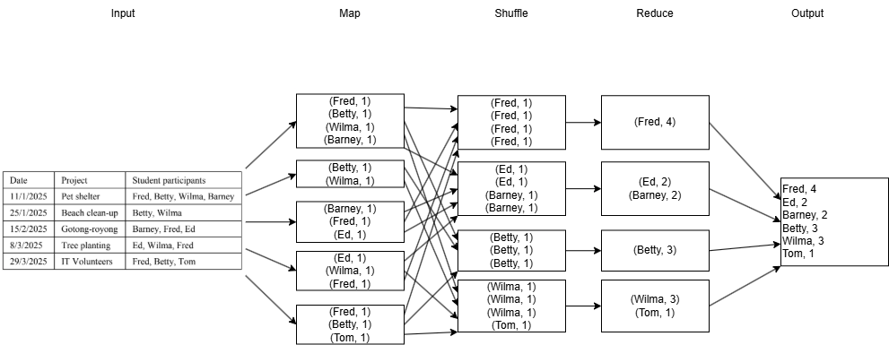
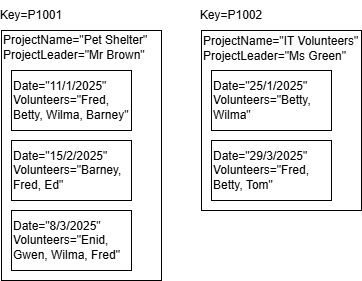
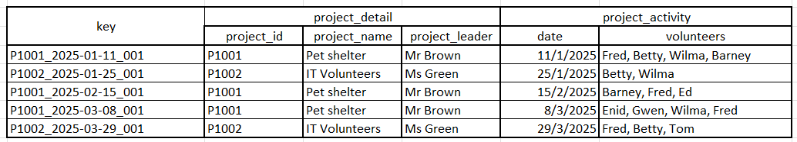

# 2025 May Exam

- [2025 May Exam](#2025-may-exam)
  - [Question 1](#question-1)
  - [Question 2](#question-2)
  - [Question 3](#question-3)
  - [Question 4](#question-4)

## Question 1

a)

- Shuffle phase takes the intermediate key-value pairs produced by the Map phase and splits them into shards based on the key, then distributes these shards across the reducer nodes.
- This phase is important to ensure all values associated with the same key are sent to the same reducer, reducing data transfer and improving efficiency.
- It also ensures keyspace is evenly distributed across reducers, preventing bottlenecks and improving load balancing.
- This allows the reducers to process the aggregation in parallel, improving the overall performance of the MapReduce job.

b)



## Question 2

a)

- Data streaming is the continuous flow of data generated by various sources, such as sensors, social media, and applications, which is processed in real-time.
- It is important for application requires immediate insights or real-time processing. For example, in a real-time fraud detection system for credit card transactions, data streaming allows the system to analyze transactions as they occur and identify potentially fraudulent activity immediately, enabling quick response to prevent financial losses.

b)

i)



ii)



## Question 3

a)

```python
[['Odie'], ['Jon', 'Hobbes'], ['Tom', 'Enid', 'Finn'], ['Jules', 'Ferb', 'Jake', 'Clare']]
```

b)

```python
['Odie', 'Jon', 'Hobbes', 'Tom', 'Enid', 'Finn', 'Jules', 'Ferb', 'Jake', 'Clare']
```

c)

```python
[('PG', 600.0), ('KL', 900.0), ('JH', 300.0)]
```

d)

```python
[('KL', 400.0, 2022), ('KL', 300.0, 2024), ('PG', 300.0, 2023)]
```

e)

```python
[('JH', 100.0, 2021), ('JH', 100.0, 2022), ('JH', 100.0, 2023), ('KL', 400.0, 2022), ('KL', 200.0, 2023), ('KL', 300.0, 2024), ('PG', 100.0, 2022), ('PG', 300.0, 2023), ('PG', 200.0, 2024)]
```

## Question 4

a)

| Authentication                                                                                                                              | Authorization                                                                                                                                                     |
| ------------------------------------------------------------------------------------------------------------------------------------------- | ----------------------------------------------------------------------------------------------------------------------------------------------------------------- |
| Mechanism to verify identity of user or service is who they claim to be                                                                     | Mechanism to determine the resource and operations an authenticated user or service is permitted to access                                                        |
| Ensures only legitimate users or services can pass the gateway to the service                                                               | Ensures authenticated users or services can only access resources and perform operations they are authorized for                                                  |
| Implemented in Hadoop using Kerberos, which provides secure authentication by issuing tickets to users and services                         | Implemented in Hadoop using Access Control Lists (ACLs), POSIX permissions, and Apache Ranger for fine-grained access control                                     |
| Without authentication, users or corrupted services could impersonate others and perform unauthorized actions, leading to security breaches | Without authorization, authenticated users or services could access data which is not meant for them, leading to data breaches and unauthorized data manipulation |

b)

i)

```cypher
MATCH (s:Staff)<-[:ASSIGNED_TO]-(:Course {code: "BAIT3343"}) 
RETURN s.name as name
```

ii)

```cypher
MATCH (:Staff {name: "Brown"})-[r:ASSIGNED_TO]->(c:Course)
RETURN c.code, r.hours
```

iii)

```cypher
MATCH (s:Staff)-[r:ASSIGNED_TO]->(c:Course)
WHERE r.hours < 6
RETURN s.name, c.code, r.hours
```
