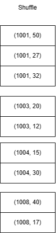
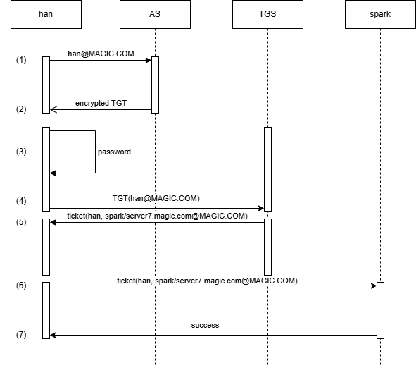
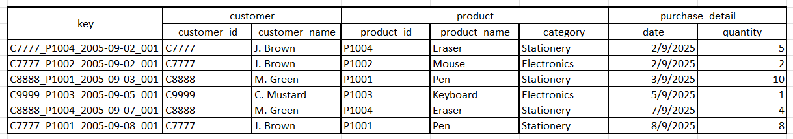
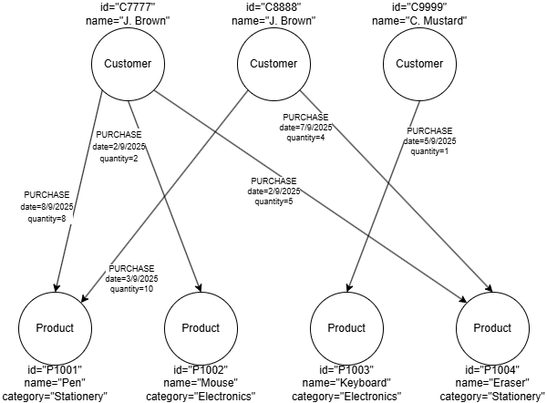

# 2025 October Exam

- [2025 October Exam](#2025-october-exam)
  - [Question 1](#question-1)
  - [Question 2](#question-2)
  - [Question 3](#question-3)
  - [Question 4](#question-4)

## Question 1

a)


b)



## Question 2

a)

- Batch processing works with bounded and complete datasets, while stream processing handles unbounded and continuous data streams. For example, batch processing is applied to all sales data bound to a single day for daily sales analysis, whereas stream processing is used for real-time monitoring of website traffic, where data is continuously processed as it arrives to aggregate the number of active users on the site.
- Batch processing result is only computed once, while stream processing produce multiple versions of the result over time. For example, batch processing is used to generate a monthly report on customer purchases, which is computed once at the end of the month, while stream processing is used for real-time fraud detection in financial transactions, where the system continuously updates its analysis as new transactions are processed.

b)

- Real-time streaming consumes data from variety of sources and process it with minimal latency. It is commonly used for ensuring consistency of data received from multiple sources. For example, in a stock trading application, real-time streaming can be used to aggregate and analyze stock price data from multiple exchanges to provide traders with up-to-date information for making immediate informed decisions.

c)

i)



ii)

- (1) <han@MAGIC.COM> initiates request to Authentication Server (AS).
- (2) AS responds by providing a Ticket-Granting Ticket (TGT) encrypted with the user's password to <han@MAGIC.COM>.
- (3) <han@MAGIC.COM> receives the TGT and prompted to enter their password, which is used to decrypt the TGT.
- (4) The descrypted TGT is then sent to the Ticket-Granting Server (TGS) for the Spark service (spark/server7.magic.com@MAGIC.COM)
- (5) TGS validates the TGT and responds with a service ticket encrypted with the TGS's secret key, which is sent back to <han@MAGIC.COM>.
- (6) The user presents the ST to the Spark service, the service decrypts the ST using the spark/server7.magic.com's secret key and validates the ticket.
- (7) Upon successful validation, the Spark service allows <han@MAGIC.COM> to use the service.

## Question 3

a)

| Characteristic     | Traditional RDBMS                                      | NoSQL Database                                          |
| ------------------ | ------------------------------------------------------ | ------------------------------------------------------- |
| Schema Flexibility | Rigid schema, predefined structure                     | Schema-less, flexible structure                         |
| Use Case           | Financial Systems, such as storing transaction records | Real-time analytics, such as storing user activity logs |

b)

i)



ii)



## Question 4

a)

```py
df = df.withColumn("population", column("population").cast("integer"))
```

b)

```py
df = df.withColumn("programme", upper(col("programme")))
```

c)

```py
df.filter(col("population") > 80).show()
```

d)

```py
new_df = df.drop("year", "semester")
```

e)

```py
programme_rdd = df.select("programme", "population").rdd
```

f)

```py
total_rdd = programme_rdd.reduceByKey(lambda x, y: x + y)
```
