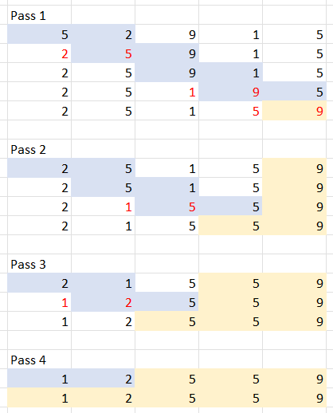
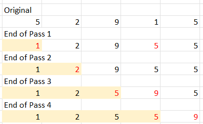
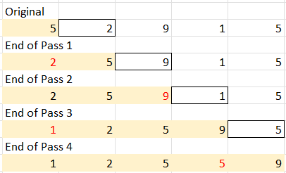
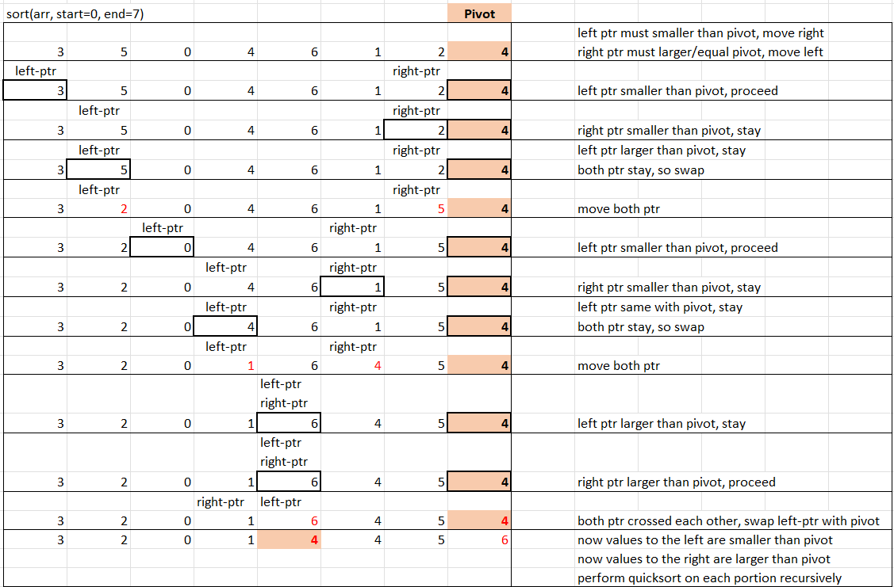
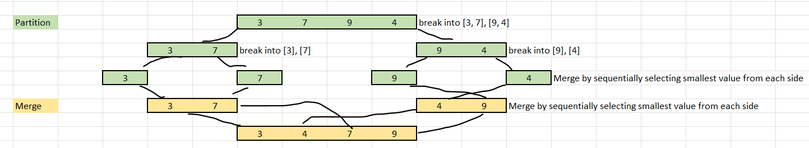
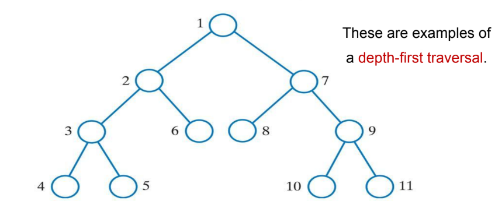
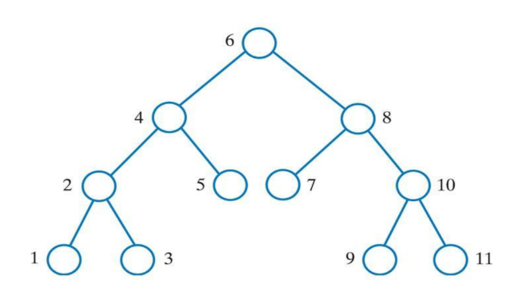
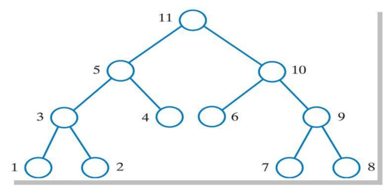
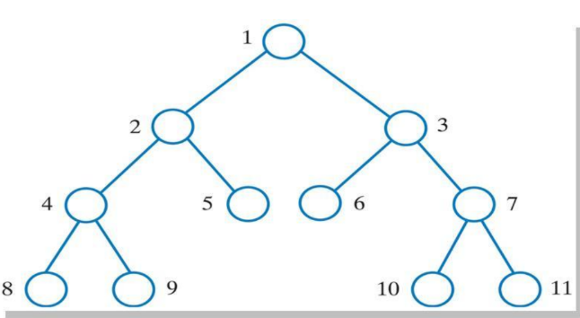
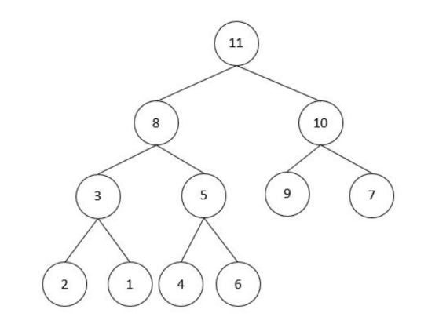

# Data Structures and Algorithms

- [Data Structures and Algorithms](#data-structures-and-algorithms)
  - [Chapter 1: Applications of ADT](#chapter-1-applications-of-adt)
    - [List](#list)
    - [Stack](#stack)
    - [Queue](#queue)
    - [Infix, Prefix, Postfix Notation](#infix-prefix-postfix-notation)
  - [Chapter 2: Abstract Data Types (ADTs)](#chapter-2-abstract-data-types-adts)
    - [ADT Specification](#adt-specification)
  - [Chapter 3: Efficiency of Algorithms](#chapter-3-efficiency-of-algorithms)
    - [Experimental Studies](#experimental-studies)
    - [Analysis of Algorithms](#analysis-of-algorithms)
  - [Chapter 4 \& 5: Array-Based Lists and Linked Lists](#chapter-4--5-array-based-lists-and-linked-lists)
    - [Array Variations](#array-variations)
    - [add(e)](#adde)
    - [add(i, e)](#addi-e)
    - [remove(i)](#removei)
    - [replace(i, e)](#replacei-e)
    - [getEntry(i)](#getentryi)
    - [contains(e)](#containse)
    - [getNumberOfEntries()](#getnumberofentries)
    - [isEmpty()](#isempty)
    - [toString()](#tostring)
  - [Chapter 6: Recursion](#chapter-6-recursion)
    - [Box Trace](#box-trace)
  - [Chapter 8a: Search Algorithms](#chapter-8a-search-algorithms)
    - [Sequential Search](#sequential-search)
    - [Binary Search](#binary-search)
  - [Chapter 8b: Sorting Algorithms](#chapter-8b-sorting-algorithms)
    - [Bubble Sort](#bubble-sort)
    - [Selection Sort](#selection-sort)
    - [Insertion Sort](#insertion-sort)
    - [Quick Sort](#quick-sort)
    - [Merge Sort](#merge-sort)
  - [Chapter 9: Binary Trees](#chapter-9-binary-trees)
    - [Binary Tree Traversal](#binary-tree-traversal)
    - [Expression Tree](#expression-tree)
    - [Binary Search Tree](#binary-search-tree)
  - [Chapter 10: Hashing](#chapter-10-hashing)
    - [Hash Function](#hash-function)
    - [Collision Resolution](#collision-resolution)
      - [Open Addressing](#open-addressing)
      - [Separate Chaining (Close Addressing)](#separate-chaining-close-addressing)
    - [Load Factor](#load-factor)

## Chapter 1: Applications of ADT

- ADT: Abstract Data Type
- OOP Terminology
  - **Modularity**: The degree to which a system's components can be separated and recombined. High modularity allows for easier maintenance and scalability.
  - **Encapsulation**: The bundling of data with the methods that operate on that data in a single unit. Restricts direct access to some of an object's components to avoid misuse and unexpected state changes.
  - **Information Hiding**: The practice of hiding the internal details of an object from the outside world. Programmer has freedom in implementing the details of the class. Users of the class only need to know how to use it, not how it works.
  - **Abstraction**: Hiding the implementation details by providing one layer of basic functionality. It allows users to interact with the system without needing to understand the underlying complexities.
  - Keywords: Maintainability, Manageability, Flexibility, Scalability, Reusability

### List

- Linear Data Structure
- Store ordered collection of elements
- Any entries can be added, removed to any position, as well as accessed by position
- Applications: List of things (tasks, students, playlist), High precision arithmetic (storing large numbers as a list of digits)

| Operation     | Description                                                           |
| ------------- | --------------------------------------------------------------------- |
| `add(e)`      | Add an element `e` to the end of the list.                            |
| `add(i, e)`   | Add an element `e` at position `i`.                                   |
| `remove(i)`   | Remove the element at position `i`.                                   |
| `isEmpty()`   | Return `true` if the list is empty, `false` otherwise.                |
| `get(i)`      | Return the element at position `i`.                                   |
| `clear()`     | Remove all elements from the list.                                    |
| `contains(e)` | Return `true` if the list contains an element `e`, `false` otherwise. |
| `size()`      | Return the number of elements in the list.                            |

- Variations: Array-based list, Linked list, Doubly linked list, Circular linked list, Sorted list, Unordered list

### Stack

- Linear Data Structure
- Store objects in a Last-In-First-Out (LIFO) manner
- Can add/remove/access the top element
- Applications: Undo/Redo, Program Stack, Expression Evaluation, Backtracking

| Operation   | Description                                                                               |
| ----------- | ----------------------------------------------------------------------------------------- |
| `push(e)`   | Add an element `e` to the top of the stack.                                               |
| `pop()`     | Remove and return the top element of the stack.                                           |
| `peek()`    | Return the top element of the stack without removing it.                                  |
| `isEmpty()` | Return `true` if the stack is empty, `false` otherwise.                                   |
| `size()`    | Return the number of elements in the stack.                                               |
| `clear()`   | Remove all elements from the stack.                                                       |
| `search(e)` | Return the 1-based position of element `e` from the top of the stack, or -1 if not found. |

- Variations: Array-based stack, Linked stack

### Queue

- Linear Data Structure
- Store objects in a First-In-First-Out (FIFO) manner
- Can add to the rear and remove/access from the front
- Applications: Print Queue, CPU Scheduling, Breadth-First Search

| Operation          | Description                                                |
| ------------------ | ---------------------------------------------------------- |
| `enqueue/offer(e)` | Add an element `e` to the rear of the queue.               |
| `dequeue/poll()`   | Remove and return the front element of the queue.          |
| `getFront/peek()`  | Return the front element of the queue without removing it. |
| `isEmpty()`        | Return `true` if the queue is empty, `false` otherwise.    |
| `size()`           | Return the number of elements in the queue.                |

- Variations: Array-based queue, Linked queue, Circular queue, Priority queue, Deque (Double-ended queue)

### Infix, Prefix, Postfix Notation

- Infix Notation (`A + B`) is readable but requires parentheses to indicate precedence.
- Prefix Notation (`+ A B`) and Postfix Notation (`A B +`) do not require parentheses and are easier for computers to evaluate.
- Stack can be used to evaluate prefix and postfix expressions.
- How to convert infix to postfix:
  - Given `A * B + C - D / E`
  - List down the binary operations in order of precedence
  
  | Order | Step 1. Operation | Step 2. Postfix Notation | Step 3. Insert preceding result | Explanation                                            |
  | ----- | ----------------- | ------------------------ | ------------------------------- | ------------------------------------------------------ |
  | (1)   | A * B             | A B *                    | A B *                           |                                                        |
  | (2)   | D / E             | D E /                    | D E /                           |                                                        |
  | (3)   | (1) + C           | (1) C +                  | A B * C +                       | (1) is replaced by A B *                               |
  | (4)   | (3) - (2)         | (3) (2) -                | **A B * C + D E / -**           | (3) is replaced by A B * C +, (2) is replaced by D E / |

  - Answer: `A B * C + D E / -`
- Similarly, to convert infix to prefix:
  - Given `A * B + C - D / E`
  - List down the binary operations in order of precedence
  
  | Order | Step 1. Operation | Step 2. Prefix Notation | Step 3. Insert preceding result | Explanation                                            |
  | ----- | ----------------- | ----------------------- | ------------------------------- | ------------------------------------------------------ |
  | (1)   | A * B             | * A B                   | * A B                           |                                                        |
  | (2)   | D / E             | / D E                   | / D E                           |                                                        |
  | (3)   | (1) + C           | + (1) C                 | + * A B C                       | (1) is replaced by * A B                               |
  | (4)   | (3) - (2)         | - (3) (2)               | **- + * A B C / D E**           | (3) is replaced by + * A B C, (2) is replaced by / D E |

  - Answer: `- + * A B C / D E`

## Chapter 2: Abstract Data Types (ADTs)

- **Abstraction**
  - **Simplifying complex systems** by hiding unnecessary details and exposing only the essential features.
  - **Manage complexity**, enhance understandability to support higher-level thinking.
  - **Enhance reusability** by allowing programmers to use and reuse components without needing to understand their internal workings.
  - **Improve maintainability** by isolating changes to specific components without affecting the entire system.
  - **Facilitate communication** by providing contracts (interfaces) that define how components interact, enabling better collaboration among developers.

> [!IMPORTANT]
>
> Abstraction allows focus on abstract properties without worrying how it is implemented, while encapsulation allows using the component without worrying how it works internally.

### ADT Specification

- **Title**: A concise name for the ADT.
- **Description**: A brief overview of the characteristics (logical properties) of the ADT.
- **Operations**: A list of operations that can be performed on the ADT
  - **Operation Header**: Return Type, Operation Name, Parameters
  - **Operation Description**: A brief explanation of what the operation does.
  - **Preconditions**: Conditions that must be true before the operation can be executed.
  - **Postconditions**: Conditions that will be true after the operation has been executed.
  - **Return**: The meaning of the return value, if applicable.

## Chapter 3: Efficiency of Algorithms

### Experimental Studies

- **Empirical Analysis**: Running the algorithm with various inputs and measuring its performance (e.g., execution time, memory usage).
- Comparison is difficult due to the need of consistent hardware and software environments
- Can only prove limited set of inputs
- Must be fully working implementation to conduct the study

### Analysis of Algorithms

- Using **Space Complexity and Time Complexity** to analyze the efficiency of algorithms without needing to implement them.
- Space-Time Tradeoff: Sometimes, we can reduce the time complexity of an algorithm by using more space (e.g., memoization), and vice versa.
- Using Big O Notation to express the time efficiency of an algorithm as a factor of the problem size (n).
- Counting primitives operations (e.g., comparisons, assignments) to determine the time complexity.
  - Assignation
  - Following object reference
  - Arithmetic operation
  - Comparison of two numbers
  - Accessing an array element by index
  - Calling a method
  - Returning from a method
- Worst-case analysis is easier, and more useful as it provides an upper bound on the running time of the algorithm.
- Example:
  
  ```java
  public int sum(int[] arr) {
      int total = 0; // 1 assignation
      for (int i = 0; i < arr.length; i++) {
          total += arr[i]; // n accesses by index, n arithmetic operations, n assignation
      }
      return total; // 1 return
  }
  ```

  - Total operations: 1 (assignation) + n (accesses) + n (arithmetic operations) + n (assignation) + 1 (return) = 3n + 2
  - Discarding constants and lower order terms, the time complexity is O(n).

- Common time complexities:
  - **O(1)**: Constant time
  - **O(log n)**: Logarithmic time
  - **O(n log n)**: Linearithmic time
  - **O(n)**: Linear time
  - **O(n^2)**: Quadratic time
  - **O(n^3)**: Cubic time
  - **O(b^n)**: Exponential time

## Chapter 4 & 5: Array-Based Lists and Linked Lists

### Array Variations

- Used in queue, maintain `frontIndex` that used for dequeue/remove, and `backIndex` that used for enqueue/add.
- Linear array with fixed front
  - When remove from front, shift the other element to front to maintain `frontIndex = 0`.
  - Slow, need to relocate all other elements
- Linear array with dynamic front
  - When remove from front, shift the `frontIndex` forward.
  - Fast, but lesser space can be used as deletion happens due to **rightward drift**.
- Circular array
  - Dynamic front, when the space after front used up, loop to the index 0 and continue to use.
  - Fast and space optimised, but index interation need to update from `++i` to `++i % containerSize`

### add(e)

- Array: O(1)

```java
public boolean add(T entry) {
    // Directly add
    array[numOfEntries] = entry; 
    numOfEntries++;
    return true;
}
```

- Linked List: O(1)

```java
public boolean add(T entry) {
    Node newNode = new Node(entry);

    if (isEmpty()) { 
        // List empty, new node becomes head
        head = newNode;
    } else {
        // Traverse to the end of the list
        // and add the new node there
        Node curr = head;
        while (curr.next != null) {
            curr = curr.next;
        }
        curr.next = newNode;
    }
    numOfEntries++;
    return true;
}
```

### add(i, e)

- Array: O(n)

```java
// Assume index is 0-based
public boolean add(int index, T entry) {
    boolean isSuccess = true;

    // Check index is valid
    if (index < 0 || index > numOfEntries) {
        isSuccess = false;
    } else {
        makeRoom(index);
        array[index] = entry;
        numOfEntries++;
    }

    return isSuccess;
}

private void makeRoom(int index) {
    // Shift elements to the right to make 
    // room for the new entry
    // Starts from the last entry so that 
    // no overwrite happens
    for (int i = numOfEntries - 1; i >= index; i--) {
        array[i + 1] = array[i];
    }
}
```

- Linked List: O(n)

```java
// Assume index is 0-based
public boolean add(int index, T entry) {
    boolean isSuccess = true;

    // Check index is valid
    if (index < 0 || index > numOfEntries) {
        isSuccess = false;
    } else {
        Node newNode = new Node(entry);

        // If index is 0, new node becomes 
        // the new head
        if (index == 0) {
            newNode.next = head;
            head = newNode;
        } else {
            Node curr = head;

            // Traverse to the node before 
            // the desired index
            for (int i = 0; i < index - 1; i++) {
                curr = curr.next;
            }

            // Insert the new node between 
            // curr and curr.next
            newNode.next = curr.next;
            curr.next = newNode;
        }
        numOfEntries++;
    }

    return isSuccess;
}
```

### remove(i)

- Array: O(n)

```java
// Assume index is 0-based
public T remove(int index) {
    // To be returned
    T removedEntry = null;

    // If index is valid
    if (index >= 0 && index < numOfEntries) {
        removedEntry = array[index];
        removeGap(index);
        numOfEntries--;
    }

    return removedEntry;
}

private void removeGap(int index) {
    // Shift elements to the left to fill the gap
    for (int i = index; i < numOfEntries - 1; i++) {
        array[i] = array[i + 1];
    }
}
```

- Linked List: O(n)

```java
// Assume index is 0-based
public T remove(int index) {
    // To be returned
    T removedEntry = null;

    // If index is valid
    if (index >= 0 && index < numOfEntries) {
        // If index is 0, head becomes the next node
        if (index == 0) {
            removedEntry = head.data;
            head = head.next;
        } else {
            Node curr = head;

            // Traverse to the node before 
            // the desired index
            for (int i = 0; i < index - 1; i++) {
                curr = curr.next;
            }

            removedEntry = curr.next.data;
            // Remove the node at the desired index
            curr.next = curr.next.next;
        }
        numOfEntries--;
    }

    return removedEntry;
}
```

### replace(i, e)

- Array: O(1)

```java
// Assume index is 0-based
public boolean replace(int index, T entry) {
    boolean isSuccess = true;
    // If index is valid
    if (index >= 0 && index < numOfEntries) {
        array[index] = entry;
    } else {
        isSuccess = false;
    }

    return isSuccess;
}
```

- Linked List: O(n)

```java
// Assume index is 0-based
public boolean replace(int index, T entry) {
    boolean isSuccess = true;
    // If index is valid
    if (index >= 0 && index < numOfEntries) {
        Node curr = head;

        // Traverse to the node at the desired index
        for (int i = 0; i < index; i++) {
            curr = curr.next;
        }

        curr.data = entry;
    } else {
        isSuccess = false;
    }

    return isSuccess;
}
```

### getEntry(i)

- Array: O(1)

```java
// Assume index is 0-based
public T getEntry(int index) {
    T result = null;

    // If index is valid
    if (index >= 0 && index < numOfEntries) {
        result = array[index];
    }

    return result;
}
```

- Linked List: O(n)

```java
// Assume index is 0-based
public T getEntry(int index) {
    T result = null;

    // If index is valid
    if (index >= 0 && index < numOfEntries) {
        Node curr = head;

        // Traverse to the node at the desired index
        for (int i = 0; i < index; i++) {
            curr = curr.next;
        }

        result = curr.data;
    }

    return result;
}
```

### contains(e)

- Array: O(n)

```java
public boolean contains(T entry) {
    boolean found = false;

    for (int i = 0; i < numOfEntries && !found; i++) {
        if (array[i].equals(entry)) {
            found = true;
        }
    }
    return found;
}
```

- Linked List: O(n)

```java
public boolean contains(T entry) {
    boolean found = false;
    Node curr = head;

    while (curr != null && !found) {
        if (curr.data.equals(entry)) {
            found = true;
        }
        curr = curr.next;
    }
    return found;
}
```

### getNumberOfEntries()

- Array: O(1)

```java
public int getNumberOfEntries() {
    return numOfEntries;
}
```

- Linked List: O(1)

```java
public int getNumberOfEntries() {
    return numOfEntries;
}
```

### isEmpty()

- Array: O(1)

```java
public boolean isEmpty() {
    return numOfEntries == 0;
}
```

- Linked List: O(1)

```java
public boolean isEmpty() {
    return numOfEntries == 0;
}
```

### toString()

- Array: O(n)

```java
public String toString() {
    String output = "";

    for (int i = 0; i < numOfEntries; i++) {
        output += array[i].toString() + "\n";
    }

    return output;
}
```

- Linked List: O(n)

```java
public String toString() {
    String output = "";
    Node curr = head;

    while (curr != null) {
        output += curr.data.toString() + "\n";
        curr = curr.next;
    }

    return output;
}
```

## Chapter 6: Recursion

- Glossary:
  - **Recursion**: Problem solving process that breaks a problem into identical smaller problems until a base case is reached.
  - **Recursive Definition**: A definition in which something is defined in terms of smaller instances of itself.
  - **Stopping Case**: Or base case, which solution can be obtained directly without recursion.
  - **Recursive Case**: The case in which the problem can be solved by breaking it down into smaller instances of the same problem.
  - **Recursive Algorithm**: An algorithm that finds a solution to a problem by calling itself with smaller instances of the same problem.
  - **Recursive Method**: A method that calls itself in its own definition.
- Principles of Recursion:
  - Every recursive definition must have one or more stopping cases.
  - A recursive case must eventually lead to a stopping case.
  - The stopping case must stop the recursion
- Example: Factorial function
  
  ```java
  public int factorial(int n) {
    if (n == 0) { // Stopping case
        return 1;
    } else { // Recursive case
        return n * factorial(n - 1);
    }
  }
  ```

- **Advantages**: Simpler to understand than iterative implementation, simpler to write by exploiting the repetitive structure which can avoid complex case analyses & nested loops
- **Disadvantages**: Poor efficiency due to repeated calculations, can lead to stack overflow if the recursion depth is too large, iterative solutions are often more efficient in terms of time and space complexity, but may be more complex to understand and write.
- **Mutual Recursion**: When two or more methods call each other in a recursive manner. Very hard to understand and debug, should be avoided if possible.

### Box Trace

- For each box, include the arguments and expressions
- Use call arrow and return arrow to connect the boxes
- Label the return arrow with the return value

- Example: `factorial(3)`

    ```text
    int result = factorial(3); <--+
                    |             | return 6
                    v             |
            +------------------+  | 
            | n = 3            |--+
            | 3 * factorial(2) |<-+
            +------------------+  |
                    |             | return 2
                    v             |
            +------------------+  |
            | n = 2            |--+
            | 2 * factorial(1) |<-+
            +------------------+  |
                    |             | return 1
                    v             |
            +------------------+  |
            | n = 1            |--+
            | 1 * factorial(0) |<-+
            +------------------+  |
                    |             | return 1
                    v             |
            +------------------+  |
            | n = 0            |--+
            | return 1         |
            +------------------+
    ```

## Chapter 8a: Search Algorithms

| **Search Algorithm** | Best Case | Average Case | Worst Case |
| -------------------- | --------- | ------------ | ---------- |
| Sequential Search    | O(1)      | O(n)         | O(n)       |
| Binary Search        | O(1)      | O(log n)     | O(log n)   |

### Sequential Search

- Or linear search
- Used when the data is unsorted or when the data structure does not allow for efficient searching (e.g., linked list)
- Refer to the code of `contains(e)` method. [See above](#containse)

### Binary Search

- Used only when the data is sorted
- Pseudocode:

    ```java
    public boolean binarySearch(T[] array, int first, int last, T target) {
        // mid = (first + last) / 2 can cause overflow when first and last are large
        int mid = first + (last - first) / 2;

        if (first > last) { 
            // Base case: target not found
            return false; 
        } else if (target.compareTo(array[mid]) == 0) {
            // Base case: target found
            return true; 
        } else if (target.compareTo(array[mid]) < 0) {
            // Target is in the left half
            return binarySearch(array, first, mid - 1, target);
        } else {
            // Target is in the right half
            return binarySearch(array, mid + 1, last, target);
        }
    }
    ```

- Example: Searching for 3 in the array [1, 3, 5, 7, 9]

    ```text
    1. binarySearch(array, 0, 4, 3)
    first = 0, last = 4, mid = 2
    array[mid] = 5
    3 < 5, so search in the left half

    2. binarySearch(array, 0, 1, 3)
    first = 0, last = 1, mid = 0
    array[mid] = 1
    3 > 1, so search in the right half

    3. binarySearch(array, 1, 1, 3)
    first = 1, last = 1, mid = 1
    array[mid] = 3
    3 == 3, target found, return true
    ```

## Chapter 8b: Sorting Algorithms

| **Sorting Algorithm** | Best Case (Sorted)              | Average Case | Worst Case                                 |
| --------------------- | ------------------------------- | ------------ | ------------------------------------------ |
| Bubble Sort           | O(n)                            | O(n^2)       | O(n^2) (Reverse Sorted)                    |
| Selection Sort        | O(n^2)                          | O(n^2)       | O(n^2)                                     |
| Insertion Sort        | O(n)                            | O(n^2)       | O(n^2) (Reverse Sorted)                    |
| Quick Sort            | O(n log n) (Evenly Partitioned) | O(n log n)   | O(n^2) (Smallest/Largest Element as Pivot) |
| Merge Sort            | O(n log n)                      | O(n log n)   | O(n log n)                                 |

### Bubble Sort

- Repeatedly steps through the list, compares adjacent elements and swaps them if they are in the wrong order
- For every pass, the largest unsorted element "bubbles up" to its correct position
- Example: Sorting the array [5, 2, 9, 1, 5]

  

### Selection Sort

- Divides the input list into two parts: the sorted part and the unsorted part
- Repeatedly selects the smallest (or largest) element from the unsorted part and moves it to the end of the sorted part
- Example: Sorting the array [5, 2, 9, 1, 5]

  

### Insertion Sort

- Good for small datasets or partially sorted arrays
- Builds the sorted array one item at a time by repeatedly taking the next item and inserting it into the correct position in the already sorted part
- Example: Sorting the array [5, 2, 9, 1, 5]

  

### Quick Sort

- Uses a divide-and-conquer approach
- Selects a "pivot" element and partitions the array into two sub-arrays: less than the pivot and greater than the pivot, commonly using the last element as the pivot
- Recursively applies the same process to the sub-arrays
- Example: Sorting the array [3, 5, 0, 4, 6, 1, 2, 4]

  

- Pivot selection is crucial for performance. Choosing the smallest or largest element as the pivot can lead to O(n^2) time complexity in the worst case.
- Strategy: Using the median of the `first`, `middle`, and `last` elements as the pivot (median-of-three method)

### Merge Sort

- Also uses a divide-and-conquer approach
- Same performance regardless of the initial order of the elements
- Divides the array into two halves, recursively sorts each half, and then merges the sorted halves back together
- Example: Sorting the array [3, 5, 0, 4, 6, 1, 2, 4]

  

- Disadvantage: Requires additional space for the temporary arrays used during the merge process, resulting in O(n) space complexity.

## Chapter 9: Binary Trees

- A binary tree is a hierarchical data structure in which each node has at most two children, referred to as the left child and the right child.
- Glossary:
  - **Node**: The basic unit of a binary tree, containing data and references to its left and right children.
  - **Root**: The topmost node of the tree, which has no parent.
  - **Leaf**: A node that has no children.
  - **Subtree**: A tree consisting of a node and all its descendants.
  - **Height**: The length of the longest path from the root to a leaf. A tree with only one node has a height of 0.
  - **Sibling**: Nodes that share the same parent.
  - **Path**: A sequence of nodes and edges connecting a node with a descendant.
  - **Subtree**: A tree consisting of a node and all its descendants.

### Binary Tree Traversal

- **Preorder Traversal**: Visit the root node before subtrees.
  
  - root -> left subtree -> right subtree
  - Useful for depth-first search and for copying a tree, as it visits the parent before the children.
- **Inorder Traversal**: Recursively traverse the left subtree first, then visit the root node, followed by the right subtree.
  
  - left subtree -> root -> right subtree
  - Useful for binary search trees, as it visits the nodes in sorted order.
- **Postorder Traversal**: Visit the root node after visiting the left and right subtrees.
  
  - left subtree -> right subtree -> root
  - Useful for deleting a tree, as it visits the children before the parent.
- **Level-order Traversal**: Visit the nodes level by level from left to right.
  
  - Useful for breadth-first search and for printing the tree level by level.
- Practice

  

  - Preorder: 11, 8, 3, 2, 1, 5, 4, 6, 10, 9, 7
  - Inorder: 2, 3, 1, 8, 4, 5, 6, 11, 9, 10, 7
  - Postorder: 2, 1, 3, 4, 6, 5, 8, 9, 7, 10, 11
  - Level-order: 11, 8, 10, 3, 5, 9, 7, 2, 1, 4, 6

### Expression Tree

- A binary tree used to represent arithmetic expressions, where internal nodes represent operators and leaf nodes represent operands.
- **Inorder Traversal** of an expression tree gives the infix notation of the expression.
- **Preorder Traversal** of an expression tree gives the prefix notation of the expression.
- **Postorder Traversal** of an expression tree gives the postfix notation of the expression.

### Binary Search Tree

- A binary tree in which each node has a key greater than all keys in the left subtree and less than all keys in the right subtree.
- Allows for efficient searching, insertion, and deletion operations.
- Uses inorder traversal to retrieve the keys in sorted order.
- Balanced binary search trees (e.g., AVL trees, Red-Black trees) perform better than skewed binary search trees, but require rotations to maintain balance after insertions and deletions.

## Chapter 10: Hashing

- A technique for mapping data of arbitrary size to fixed-size values (hash codes) using a hash function.
- Used for efficient data retrieval, as it allows for constant average time complexity for search, insertion, and deletion operations.
- ADT: Map, Table, Associative Array

### Hash Function

- A function that takes an input (or "key") and returns a fixed-size string of bytes (the "hash code"), which is typically a number.
- Good hash functions:
  - Minimize collisions
  - Distribute hash codes uniformly across the hash table
  - Fast to compute
- **Hash table size**: Use a prime number, so that the hash codes are more uniformly distributed and reduce the chances of collisions.
- Methods:
  - **Division Method**: `hash(key) = key mod tableSize`
    - Simple but can lead to clustering if tableSize is not chosen carefully (e.g., a prime number).
    - Example: For a hash table of size 10, the keys 12, 22, and 32 would all hash to the same index (2), leading to collisions.
  - **Mid-Square Method**: Square the key and extract the middle digits as the hash code.
    - Can provide better distribution of hash codes, but is more computationally expensive than the division method.
    - Example: For a key of 123, squaring it gives 15129. Extracting the middle 3 digits gives a hash code of 512.
    - Note: The number of middle digits extracted should be chosen based on the size of the hash table to ensure a good distribution of hash codes.
  - **Folding Method**: Break the key into parts, then combine using addition or XOR to produce the hash code.
    - Can provide good distribution of hash codes, but is more complex to implement than the division method.
    - Example: For a key of 123456, break it into parts (123 and 456), then XOR them together to get a hash code of 435.
- **Compression**: Compress the hash code to fit within the bounds of the hash table size.
  - Use modulo if too large
  - Add hash table size if negative

### Collision Resolution

#### Open Addressing

- When a collision occurs, the algorithm searches for the next available slot in the hash table to store the key-value pair.
- Methods:
  - **Linear Probing**: Check the next slot sequentially until an empty slot is found. Can lead to clustering, where groups of occupied slots form, increasing the number of probes needed to find an empty slot.
  - **Quadratic Probing**: Check slots at intervals that grow quadratically (e.g., k + 1^2, k + 2^2, k + 3^2). Reduces clustering but can still lead to secondary clustering, where keys that hash to the same initial index follow the same probe sequence.
  - **Double Hashing**: Use a second hash function to determine the step size for probing. Provides better distribution of keys and avoids clustering.
- **Available Status**: Not only using "Occupied" and "Empty", mark slots as "Available" when a key-value pair is deleted, this is to ensure that probing won't stop prematurely when the target key is after the deleted slot.
- Frequent addition and deletion can lead to performance degradation due to filling of "Available" slots, every search will have to probe through these "Available" slots

#### Separate Chaining (Close Addressing)

- Each slot in the hash table contains a linked list (or another data structure) act as a bucket to store all key-value pairs that hash to the same index.
- When a collision occurs, the new key-value pair is added to the linked list at the corresponding index.
- Advantages:
  - Simple to implement
  - Can handle a large number of collisions without performance degradation, as the linked list can grow dynamically.
  - Deletion is straightforward, as it only involves removing the key-value pair from the linked list.
  - Does not require rehashing, as the linked lists can grow as needed.
- Disadvantages:
  - Requires additional memory for the linked lists, which can lead to increased space complexity.
  - Performance can degrade if many key-value pairs hash to the same index, as it will require traversing the linked list to find the target key-value pair.

### Load Factor

- The load factor is a measure of how full the hash table is, calculated as the number of occupied slots divided by the total size of the hash table.

  > [!NOTE]
  > For probing, consider "Available" slots as occupied so that the load factor reflects the actual performance of the hash table

- A high load factor can lead to increased collisions and degraded performance, while a low load factor can lead to wasted space.
- **Rehashing**: When the load factor exceeds a certain threshold, create a new hash table with a larger size and rehash all existing key-value pairs into the new table.
- For open addressing, a load factor less than 0.5 is generally recommended to maintain efficient search, insertion, and deletion operations before rehashing is needed.
- For separate chaining, a load factor of 1 or less is generally acceptable, as the linked lists can handle collisions without significant performance degradation.
