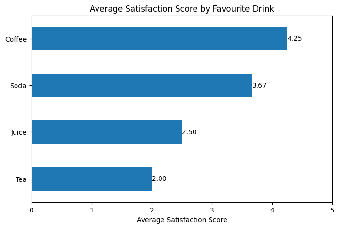

# 2026 January Exam

## Question 1

a)

| Problem and Consequences                                                                                                                                            | Solution                                                                              |
| ------------------------------------------------------------------------------------------------------------------------------------------------------------------- | ------------------------------------------------------------------------------------- |
| Column bars are not sorted according to the age but according to the bar height, the trend of the age may be obscured to the audience, such as skewness or outliers | Sort the bars by age to show the trend clearly                                        |
| X-axis tick labels are rotated by 45 degrees anticlockwise, making them hard to read                                                                                | Keep the x-axis labels upright to improve readability                                 |
| The font size of the tick labels of both axes are not the same, making it look unbalanced and distracting to the audience                                           | Use the same font size for both axes to create a more balanced and professional look  |
| Bars values are not labeled, making the audience hard to interpret the exact values of each bar                                                                     | Add data labels on top of each bar to show the exact values for better interpretation |
| X-axis is not labeled, the audience may not understand what is the frequency distribution being shown by the bars                                                   | Add a label for the x-axis, such as "Age Groups", to clarify what the bars represent  |

b)

i) Make a figure for the generals.

- This principle is important because decision makers want to quickly understand the key insights from the data so they can make informed decisions promptly.
- A clear and concise figure allows them to grasp the main message, avoiding complexity, jargon and unnecessary dimensions that may distract or confuse them.
- By simplifying the visualisation and focusing on the key message, it helps decision makers to quickly understand the insights and take appropriate actions based on the data.
- For example, if a company is presenting sales data to its executives, a simple bar chart showing the top-selling products with clear labels and a concise title would be more effective than a complex scatter plot with multiple variables and colors, since the executives can recognise the height of the bars at first glance and understand which products are performing well without needing to interpret a more complex visualisation.

ii) Be consistent but don't be repetitive.

- This principle is important because using consistent visual elements such as color schemes, fonts and layouts helps to create a cohesive and professional look for the visualisation, making it easier for the audience to follow and understand the data.
- The audience may rely on specific visual cues to read the visualisation and understand the structure of the information being presented. If the visualisation is inconsistent, it may cause confusion and make it harder for the audience to interpret the data correctly.
- However, it is also important to avoid being repetitive by using the same style and type of figures repeatedly, as this can lead to visual fatigue and make them harder to distinguish between different sections of the visualisation.
- By introducing some variation in the visual elements while maintaining overall design language, it can help to signal transitions between different sections and keep the audience engaged without overwhelming them with too much uniformity.
- For example, a sales report may use a consistent color scheme and font style throughout the report, but it can vary the types of charts used (e.g. bar charts for sales by product, line charts for sales trends over time) to keep the audience engaged and help them differentiate between different types of information being presented.

## Question 2

a)

| Column Name        | Type of Variable    | Appropriate Scale |
| ------------------ | ------------------- | ----------------- |
| ID                 | Categorical Nominal | Discrete          |
| Age                | Numerical           | Discrete          |
| Level of Study     | Categorical Ordinal | Discrete          |
| Favourite Drink    | Categorical Nominal | Discrete          |
| Satisfaction Score | Numerical           | Discrete          |

b)

i)

ii)

- **Insight 1:** Coffee is the favourite drink with highest average satisfaction score of 4.25.
- The company should maintain the quality of coffee and consider expanding the choice of coffee to cater to the preferences of these customers, which can enhance customer satisfaction and loyalty.
- **Insight 2:** Tea is the favourite drink with lowest average satisfaction score of 2.00.
- The company should investigate the reasons for the low satisfaction with tea and consider improving its quality or offering alternatives to meet customer expectations.

## Question 3

a)

i)

- **Pie chart**: Best for showing how one whole is divided among a small number of categories, since each slice directly represents a proportion of the total.
- **Stacked bar chart**: Also shows parts of a whole, especially useful when comparing several wholes (e.g. across groups or time). Each bar represents a total, with segments showing proportions.
- **Grouped bar chart**: Least effective for proportions of a whole, because bars are separated rather than combined into one total. Better for comparing same category values between groups.

ii)

- **Pie chart**: Easy to identify largest/smallest shares, but harder to compare similar-sized slices accurately.
- **Stacked bar chart**: Good for comparing total composition across groups, but harder to compare middle segments since they lack a common baseline.
- **Grouped bar chart**: Best for comparing category sizes across groups, because bars share a common baseline, but weaker for showing proportions of a whole.

iii)

- Grouped bar chart
- Pie chart
- Stacked bar chart

b)

- The scatter plot shows a moderate positive correlation between the body mass and head length of the blue jays, indicating that as body mass increases, head length tends to increase as well.
- The variability is moderate, stays consistent across the range of body masses, suggesting a relatively uniform relationship between the two variables.
- There is a potential outlier which has a body mass of around 63 grams and a head length of around 57 mm, which is slightly higher than the general trend of the other data points.

## Question 4

a)

- Choropleth can be used to show the density of the COVID-19 cases across different regions, with darker colors representing higher case density.
- This allows for easy identification of hotspots, enabling public health officials to allocate resources and implement targeted interventions effectively.

b)

i) The points can be adjusted to semi-transparent, which allows for better visibility of overlapping points. This way, areas with higher density of points will appear darker, making the hotspots more visible. In addition, the transparency helps with showing dominant categories in the hotspot, as the colors of the dominant categories will be more visible in areas with many overlapping points.

ii) Jittering applies a small random displacement to the points, which can separate points that would otherwise overlap. This way, the general hotspots will be much clearer, as it will look more dense in areas with many points. However, the parameters of jittering need to be carefully chosen, as too much jittering can distort the spatial distribution of the points and make it harder to identify the true hotspots.

c) Illustrate 2 common pitfalls of using color in visualisation and the impact of each mistake.

| Pitfall                                 | Example                                                                                    | Impact                                                                                                                                                                                                                                              |
| --------------------------------------- | ------------------------------------------------------------------------------------------ | --------------------------------------------------------------------------------------------------------------------------------------------------------------------------------------------------------------------------------------------------- |
| Using rainbow scale for continuous data | A heatmap showing temperature variations using a rainbow color scale.                      | The rainbow scale can create artificial boundaries due to the brightness variations,  making it difficult for viewers to accurately interpret the data and identify trends, as the colors may not correspond to meaningful differences in the data. |
| Ignoring CVD                            | A bar chart showing the distribution of a categorical variable using red and green colors. | This can make the chart inaccessible to viewers with color vision deficiency, as they may not be able to distinguish between the red and green bars, leading to misinterpretation of the data.                                                      |
