# Data Visualization

- [Data Visualization](#data-visualization)
  - [Chapter 1 Intro to Data Visualization](#chapter-1-intro-to-data-visualization)
    - [Intro to Data Visualization](#intro-to-data-visualization)
    - [Types of Bad Figures](#types-of-bad-figures)
    - [Principles of Data Visualization](#principles-of-data-visualization)
    - [Aesthetic Mapping](#aesthetic-mapping)
    - [Mappings](#mappings)
    - [Effective Mapping](#effective-mapping)
    - [Use case and plots](#use-case-and-plots)
  - [Chapter 2 Effective Storytelling](#chapter-2-effective-storytelling)
    - [Narrative Structures](#narrative-structures)
    - [Designing for Decision Makers](#designing-for-decision-makers)
    - [Image format](#image-format)
  - [Chapter 3: Visualising Amount and Distribution](#chapter-3-visualising-amount-and-distribution)
    - [3.1 Showing Amounts (Comparing Categories)](#31-showing-amounts-comparing-categories)
      - [Core Principle](#core-principle)
      - [3.1.1 Bar Charts and Variants](#311-bar-charts-and-variants)
      - [3.1.2 Alternatives to Bars](#312-alternatives-to-bars)
      - [Summary Table: Bad Practices and Fixes for Bar Charts](#summary-table-bad-practices-and-fixes-for-bar-charts)
    - [3.2 Visualising Distributions (Single Numerical Variable)](#32-visualising-distributions-single-numerical-variable)
      - [3.2.1 Histogram](#321-histogram)
      - [3.2.2 Density Plot](#322-density-plot)
      - [3.2.3 Comparing Multiple Distributions](#323-comparing-multiple-distributions)
    - [3.3 Advanced Distribution Comparisons](#33-advanced-distribution-comparisons)
      - [3.3.1 ECDF (Empirical Cumulative Distribution Function)](#331-ecdf-empirical-cumulative-distribution-function)
      - [3.3.2 Highly Skewed Distributions (e.g., power‑law)](#332-highly-skewed-distributions-eg-powerlaw)
      - [3.3.3 Q‑Q Plot (Quantile‑Quantile Plot)](#333-qq-plot-quantilequantile-plot)
    - [3.4 Visualising Many Distributions](#34-visualising-many-distributions)
      - [3.4.1 Boxplot](#341-boxplot)
      - [3.4.2 Violin Plot](#342-violin-plot)
      - [3.4.3 Strip Plot](#343-strip-plot)
      - [3.4.4 Sina Plot](#344-sina-plot)
      - [Quick Reference: Which Plot to Choose?](#quick-reference-which-plot-to-choose)
  - [Chapter 4: Visualising Proportions and Associations](#chapter-4-visualising-proportions-and-associations)
    - [4.1 Visualising Proportions](#41-visualising-proportions)
      - [4.1.1 Pie Chart](#411-pie-chart)
      - [4.1.2 Bar‑Based Proportion Plots](#412-barbased-proportion-plots)
    - [4.2 Visualising Nested Proportions](#42-visualising-nested-proportions)
      - [4.2.1 Mosaic Plot](#421-mosaic-plot)
      - [4.2.2 Treemap](#422-treemap)
    - [4.3 Visualising Associations](#43-visualising-associations)
      - [4.3.1 Scatter Plot](#431-scatter-plot)
      - [4.3.2 Paired Data Visualisation](#432-paired-data-visualisation)
  - [Chapter 5: Visualising Time Series and Trends](#chapter-5-visualising-time-series-and-trends)
    - [5.1 Visualising Time Series](#51-visualising-time-series)
      - [5.1.1 Individual Time Series](#511-individual-time-series)
      - [5.1.2 Multiple Time Series](#512-multiple-time-series)
    - [5.2 Visualising Trends](#52-visualising-trends)
      - [5.2.1 Smoothing](#521-smoothing)
      - [5.2.2 Functional Fits](#522-functional-fits)
  - [Chapter 6: Visualising Geospatial Data and Uncertainty](#chapter-6-visualising-geospatial-data-and-uncertainty)
    - [6.1 Visualising Geospatial Data](#61-visualising-geospatial-data)
    - [6.2 Visualising Uncertainty](#62-visualising-uncertainty)
      - [6.2.1 Framing Probabilities as Frequencies](#621-framing-probabilities-as-frequencies)
      - [6.2.2 Uncertainty of Point Estimates](#622-uncertainty-of-point-estimates)
  - [Chapter 7: Principles of Figure Design - Part 1](#chapter-7-principles-of-figure-design---part-1)
    - [7.1 Proportional Ink](#71-proportional-ink)
    - [7.2 Overlapping Points (Overplotting)](#72-overlapping-points-overplotting)
    - [7.3 Colour Use](#73-colour-use)
      - [Roles of Colour](#roles-of-colour)
      - [Pitfalls to Avoid](#pitfalls-to-avoid)
    - [7.4 Redundant Encoding](#74-redundant-encoding)
    - [7.5 Multipanel Figures](#75-multipanel-figures)
      - [7.5.1 Small Multiples](#751-small-multiples)
      - [7.5.2 Compound Figures](#752-compound-figures)
  - [Chapter 8: Principles of Figure Design - Part 2](#chapter-8-principles-of-figure-design---part-2)
    - [8.1 Titles, Captions, Tables](#81-titles-captions-tables)
    - [8.2 Balance Data \& Content](#82-balance-data--content)
    - [8.3 Use Larger Axis Labels](#83-use-larger-axis-labels)
    - [8.4 Avoid Line Drawing](#84-avoid-line-drawing)
    - [8.5 Avoid 3D Effects](#85-avoid-3d-effects)
  - [Find Problems in these figures and fix them](#find-problems-in-these-figures-and-fix-them)

## Chapter 1 Intro to Data Visualization

### Intro to Data Visualization

- **Data visualization**: Graphical representation of information and data
- **Purpose**: To ease communication and interpretation involving data
- Must be **accurate** and **aesthetically effective**

### Types of Bad Figures

- **Ugly**: technically correct and readable but visually unappealing (e.g. bad color choices)
- **Bad**: technically correct but misleading (e.g. truncated y-axis, cluttered data points, unclear labels)
- **Wrong**: technically incorrect in terms of math or logic (e.g. pie chart with percentages that don't add up to 100%, missing data points, incorrect scales)

### Principles of Data Visualization

- **Accurate** - Convey the data accurately, not distort it
- **Clear** - Make it not overloaded with decorations
- **Effective** - Do not let aesthetic distract from the interpretation
- **Simple** - Respect the audience perceptual limits and avoid confusion
- **Balance** - Both design and correctness are important

### Aesthetic Mapping

- Process of mapping data variables to visual properties (e.g. color, size, shape)
- Allow audience to perceive patterns and relationships in the data
- Attributes:
  - **Position**
  - **Shape**
  - **Size**
  - **Color**
  - **Line width**
  - **Line type**
- Data Types and Aesthetic Mapping:
  - **Numerical Continuous**: size, position, color gradient
  - **Numerical Discrete**: shape, color hue
  - **Nominal**: shape, color hue
  - **Ordinal**: color hue, size

### Mappings

- Line Plot: position (x, y), line type, color
- Heatmap: position (x, y), color gradient

### Effective Mapping

- Match data type with appropriate aesthetic
- Avoid overloading with too many aesthetics
- Use legends and labels effectively
- Consistent across multiple visualizations

### Use case and plots

- **Amount**
  - Bar Chart
  - Dot Plot
  - Grouped/Stacked Bar Chart
  - Heatmap (2D categorical combinations)
- **Distribution**
  - Histogram
  - Density Plot
  - Cumulative Distribution (For purpose such as comparing distributions and percentiles)
  - Boxplot/Violin Plot/Strip plot
  - Ridgeline Plot
- **Proportion**
  - Pie Chart
  - Stacked Bar Chart
  - Grouped Bar Chart
  - Multivariate
    - Mosaic Plot
    - Treemap
    - Parallel Sets
- **X-Y Relationship**
  - Scatter Plot
  - Bubble Plot
  - Line Plot
  - Slope Chart
  - Connected Scatter Plot
  - High density
    - Contour Plot
    - 2D bin/hex plot
    - Correlogram (multiple variables)
- **Geospatial**
  - Maps
  - Choropleth Map: encode data with regions colored
  - Cartogram: distort region sizes based on data values
- **Uncertainty**
  - Error Bars
  - Graded Bars (multiple levels of uncertainty)
  - Confidence Bands
  - Distribution + Intervals (e.g. violin plot, quantile dot plot, half-eye plot)

## Chapter 2 Effective Storytelling

- Guide audience through logical progression of ideas, from context and research question to visual evidence and finally interpretation and implications
- **Story**: Tension -> Resolution

### Narrative Structures

- **Opening - Challenge - Action - Resolution**
  - **Opening**: Introduce settings, status quo, stakeholders, explain why the topic matters
  - **Challenge**: Create tension by presenting core problem, barriers and its business impact
  - **Action**: Describe steps taken to address the challenge, including data collection, analysis, validation and visualization
  - **Resolution**: Conclude the results and real world implications, next steps
- **Lead - Development - Resolution**
  - **Lead**: Include surprising insights to grab audience attention, provide summarised story such as core problem statement, purpose and brief outcome
  - **Development**: Present context, data work, modeling and key findings by building depth and explore the analytical process
  - **Resolution**: Wrap up with key takeaways, recommendations and next steps

### Designing for Decision Makers

- **Make a figure for the Generals**
  - Should be able to grasp the key message quick
  - Avoid complexity, jargon, unnecessary dimensions
  - Avoid overloading with too much information
- **Build up complexity gradually**
  - Introducing figures from simple to complex
- **Make figures memorable**
  - Add visual cues relevant to the context (isotypes, pictograms)
  - Use unique visual twist (without confusing the message)
- **Consistent but not repetitive**
  - Use consistent color schemes, fonts, layouts
  - Avoid using same style and type of figures repeatedly
  - Less uniformity helps signal transitions between different sections
  - Order the figures from raw/less processed to derived/more processed
  - 3 to 6 figures is a good number for scientific paper

### Image format

- Bitmap / Raster
  - Made of colored pixels
  - Resolution dependent
  - Lossless and lossy compression
- Vector
  - Store geometric descriptions of graphic elements
  - Redrawn at rendering time
  - Resolution independent
  - BUT platform dependent (fonts may not be available on all systems)
    - But can be mitigated by embedding fonts in the file
  - Complex figures may be large and slow to render
- Tradeoff between performance and fidelity
- Use vector for publication, print, archival; Use bitmap for interactive/online use
  - JPEG for photographs
  - PNG for line art/charts
  - SVG for icons, interactive graphics
- Store master file as SVG, so it can be easily converted to other formats as needed, and maintain a high quality master file for future use
You're right. The previous refactoring kept the original section numbering but didn't reorganize the content for conceptual coherence. Below is a **fully restructured** version that groups related concepts together, uses consistent terminology, and presents information in a logical, digestible flow—while preserving all original content and chapter boundaries.

## Chapter 3: Visualising Amount and Distribution

### 3.1 Showing Amounts (Comparing Categories)

#### Core Principle

- Bar height (or length) represents value.
- Always order bars by value (descending) unless a natural order exists (time, age groups).
- Y‑axis must start at zero; otherwise use a dot plot.

#### 3.1.1 Bar Charts and Variants

- **Standard bar chart** (vertical): Default choice.
- **Horizontal bar chart**: Use when category names are long.
- **Grouped bar plot**: For two categorical variables (few groups). Colour legend required. Gets cluttered with many groups → use faceted bars instead.
- **Stacked bar plot**: Use when total per group matters. Hard to compare individual categories across groups because baselines differ. Good for cumulative values (e.g., population pyramids).
- **Faceted bar plot** (small multiples): One bar plot per group. Less cluttered than grouped bars, easier comparison. Requires more space.

#### 3.1.2 Alternatives to Bars

- **Dot plot**: Dots only, no bars. **Y‑axis need not start at zero**. Best when differences are small or many categories would clutter a bar chart. Order categories properly to avoid a “cloud of points”.
- **Heatmap**: Colour intensity encodes amount in a 2D matrix. Handles large datasets, shows patterns over time. Hard to read exact values (emphasises patterns). Arrange rows to tell a story.

#### Summary Table: Bad Practices and Fixes for Bar Charts

| Bad Practice                | Problem                                     | Fix                                              |
| --------------------------- | ------------------------------------------- | ------------------------------------------------ |
| Rotated labels              | Hard to read, ugly                          | Use horizontal bar chart                         |
| Arbitrary bar order         | Hides patterns (trends, outliers, skewness) | Sort by value or natural order                   |
| Y-axis not starting at zero | Misleading area comparison                  | Start at zero; use dot plot for tiny differences |

### 3.2 Visualising Distributions (Single Numerical Variable)

#### 3.2.1 Histogram

- Data divided into equal‑width bins; bar height = frequency.
- Use to understand shape, skewness, modality, outliers, spread. Compare groups via colour or facets.
- **Bad practices & fixes:**

| Bad Practice                | Problem                                    | Fix                               |
| --------------------------- | ------------------------------------------ | --------------------------------- |
| Too few bins                | Oversimplifies, hides features             | Increase bins or use density plot |
| Too many bins               | Overcomplicates, creates noise             | Decrease bins or use density plot |
| Inconsistent bin widths     | Misleading exaggeration or hiding          | Use equal‑width bins              |
| X‑axis not starting at zero | Distorts perception (especially near zero) | Start at zero or use density plot |

#### 3.2.2 Density Plot

- Smoothed version of histogram (kernel density estimation). Continuous curve.
- Best for many data points or when shape matters more than exact values.
- **Bandwidth choices:** Too large → oversmooths (hides features). Too small → undersmooths (creates noise). Also ensure curve does not extend beyond data range (e.g., negative values for non‑negative data).

#### 3.2.3 Comparing Multiple Distributions

| Method                   | Pros                                       | Cons                                         |
| ------------------------ | ------------------------------------------ | -------------------------------------------- |
| Stacked histogram        | (none notable)                             | Baselines not aligned → very hard to compare |
| Overlapping density plot | Good for 2+ categories, clear              | –                                            |
| Faceted density plots    | One per group, same axes → easy comparison | Requires space                               |

> **Tip for Faceted Density Plots:** Add a full greyscale density plot in the background (overall distribution) and a coloured density plot in the foreground (group‑specific). This allows proportional comparison of the group to the overall distribution while retaining cross‑group comparability.

### 3.3 Advanced Distribution Comparisons

#### 3.3.1 ECDF (Empirical Cumulative Distribution Function)

- Shows percentage of data ≤ x. Y‑axis can be normalised to proportions.
- Slope = density (steeper = higher density). Easy to read median, percentiles, cutoffs. Hard to read modality (peaks).

#### 3.3.2 Highly Skewed Distributions (e.g., power‑law)

- Problem: Right‑skewed data (income, city population) is hard to visualise.
- Solution: Log transformation. A **log‑log ECDF** makes a power‑law appear as a straight line, simplifying group comparisons.
- Caution: Log scales can be hard for some audiences to interpret.

#### 3.3.3 Q‑Q Plot (Quantile‑Quantile Plot)

- Compares quantiles of your data against a reference distribution (e.g., normal).
- Reading: Points follow 45° line → data matches reference. S‑shaped curve → skewed (above line = right‑skewed, below = left‑skewed). Inverted S‑shaped → bimodal.
- Common use: Checking normality assumption.

### 3.4 Visualising Many Distributions

#### 3.4.1 Boxplot

- Shows five‑number summary (min, Q1, median, Q3, max). Box = IQR, whiskers extend to most extreme points within 1.5×IQR, points beyond = outliers.
- Use to compare distributions across groups, identify skewness, outliers, spread.
- Cannot show modality or detailed shape.
- Best for many data points (histogram/density would be cluttered). **Bad practice:** Use with <10 data points → misleading; use strip plot instead.

#### 3.4.2 Violin Plot

- Boxplot + density shape on both sides (width = density). Shows modality and overall shape.
- Best when you suspect multiple modes or have many data points. **Bad practice:** Use with few data points → misleading; use strip plot instead.

#### 3.4.3 Strip Plot

- Individual data points as dots. Problem: overplotting.
- Solution: **Jittering** – add tiny random noise horizontally. Density can be visually estimated from the spread.

#### 3.4.4 Sina Plot

- Strip plot + violin plot. Points jittered according to the violin’s width: dense regions spread points more.
- Shows both individual points and overall distribution shape.

#### Quick Reference: Which Plot to Choose?

| Goal                                    | Recommended plot(s)                                        |
| --------------------------------------- | ---------------------------------------------------------- |
| Compare amounts across categories       | Bar chart (sorted), dot plot                               |
| Two categorical variables (few groups)  | Grouped bar plot (or faceted bars)                         |
| Two categorical variables (many groups) | Faceted bar plot, heatmap                                  |
| Distribution shape (one variable)       | Histogram, density plot                                    |
| Compare many distributions              | Overlapping density, faceted density, boxplot, violin plot |
| Show raw data + distribution            | Strip plot (jittered), sina plot                           |
| Check normality                         | Q‑Q plot, ECDF                                             |
| Highly skewed / power‑law data          | Log‑log ECDF                                               |

## Chapter 4: Visualising Proportions and Associations

### 4.1 Visualising Proportions

Used in demographics, markets, surveys, etc.

#### 4.1.1 Pie Chart

- **Core idea:** Circle divided into slices representing category proportions.
- **Ordering:** Sort by size (largest to smallest) starting at 12 o’clock clockwise.
- **Use cases:** Identify proportion at a glance, compare simple fractions, detect imbalance.
- **Limitations:** Poor for comparing across time or conditions; difficult to compare similarly sized slices.
- **Bad practices & fixes:**

| Bad Practice    | Problem                 | Solution                                          |
| --------------- | ----------------------- | ------------------------------------------------- |
| Too many slices | Cluttered, hard to read | Limit to 5–7 categories; group small into “Other” |
| 3D effects      | Distorts perception     | Avoid; use bar chart or dot plot instead          |
| No labels       | Unclear proportions     | Always include labels with percentages or values  |

#### 4.1.2 Bar‑Based Proportion Plots

- **Grouped bar chart:** Compares categories across groups, compares relative proportions within groups. No part‑of‑a‑whole view.
- **Stacked bar chart:** Shows part‑of‑a‑whole and proportion comparisons across groups. Limitations: hard to compare individual categories across groups (different baselines), hard to compare relative proportions within groups, total values obscured (misleading if totals differ).
- **Stacked density plot:** Shows part‑of‑a‑whole and proportion comparisons across a continuous variable (e.g., time, age). Same limitation: totals obscured, distorted if totals differ.
- **Separate density plots:** Shows part‑of‑a‑whole of each group plus absolute values. Not distorted by differences in totals. Method: coloured density for each group, greyscale background for overall distribution.

### 4.2 Visualising Nested Proportions

When categories overlap, total exceeds 100% → pie charts invalid. Bar charts technically possible but do not show overlap clearly.

#### 4.2.1 Mosaic Plot

- 2D extension of a bar chart. Area of each rectangle represents the proportion of data in that category combination.
- Strengths: Shows proportions of each combination, allows cross‑group comparison.
- Limitation: Assumes proportions can be identified via orthogonal categories (not always true).

#### 4.2.2 Treemap

- Similar to mosaic plot but uses nested rectangles to show hierarchical relationships.
- Strengths: Works when proportions cannot be meaningfully described by combining categorical variables; shows hierarchy.
- Limitation: Difficult to compare proportions across groups.

### 4.3 Visualising Associations

Show how two or more variables are related. Reveal trends, clusters, outliers, correlations.

- **Distinction: Trends vs. Patterns**

  | Trends                                    | Patterns                                                                                          |
  | ----------------------------------------- | ------------------------------------------------------------------------------------------------- |
  | General direction of data points          | Recognisable repeating behaviour/structure                                                        |
  | Long‑term scope                           | Short‑ to medium‑term scope (within trend)                                                        |
  | Typically in time series                  | Often in time series, but also spatial, cross‑sectional                                           |
  | Example: upward trend in sales over years | Example: seasonal peaks every December, or daily website traffic patterns (higher during daytime) |

#### 4.3.1 Scatter Plot

- Plots individual points on a 2D plane (x and y). Can add colour, size, shape to encode groups (bubble plot).
- **Insights:** Correlation (positive, negative, none), variability (spread across x), outliers, clusters.
- **Limitations:** Overplotting with large datasets → use transparency or jittering. Correlation ≠ causation. May need regression to quantify.
- **Scatter plot matrix:** Grid of scatter plots for pairwise relationships (3–5 variables manageable; more overwhelming). Useful for subgroups and interactions.
- **Bubble plot:** Size of points represents a third variable. **Do not use radius to encode size** – use area (radius exaggerates differences).

#### 4.3.2 Paired Data Visualisation

- **Scatter plot for paired data** (e.g., CO₂ emissions 1990 vs. 2020): Shows changes over time, outliers, trends. Add y = x reference line to see increase/decrease.
- **Slope plot:** Each line represents a category (e.g., country). Slope indicates change over time. Helps identify which categories increased/decreased and by how much.

## Chapter 5: Visualising Time Series and Trends

### 5.1 Visualising Time Series

Time is a special independent variable with unique properties (autocorrelation, seasonality, trends).

#### 5.1.1 Individual Time Series

- **Scatter plot:** Shows individual data points over time. Good for trends, variability, outliers. Can add a line of best fit.
- **Line plot:** Guides the eye to see trends and patterns. Remove dots to de‑emphasise individual points (avoid cluttering with dense data). Not useful for sparse time points (implies continuous trend that doesn’t exist). Area shading emphasises overarching pattern – only if baseline is zero.

#### 5.1.2 Multiple Time Series

- **Scatter plot** is not ideal (cluttered with multiple series).
- **Line plot** works well. Label at the end of each line instead of using a legend for easier identification.

### 5.2 Visualising Trends

Trend is often more important than actual values; individual data points can be distracting.

#### 5.2.1 Smoothing

- **Moving average:** Simple, but smoother curves lag more and become shorter.
- **LOESS (Locally Estimated Scatterplot Smoothing):** Fits local polynomial regression.

| Strengths                   | Limitations                         |
| --------------------------- | ----------------------------------- |
| Non‑linear trends           | Slower for large datasets           |
| No global function required | Sensitive to outliers               |
| Flexible, interpretable     | Smoothing parameter affects results |

- **Spline smoothing:** Piecewise polynomials with continuity at knots. More flexible than LOESS, can capture complex trends, but more sensitive to noise and outliers. Knot placement affects results.

> [!Caution]
> Different smoothing methods can yield different trends. Check robustness by trying multiple methods and parameters. Always show data points alongside the smoothed curve to provide context and avoid misinterpretation.

#### 5.2.2 Functional Fits

- Use parametric models (linear, exponential). Interpretable parameters (e.g., slope) provide rate of change. Must check assumptions (linearity, homoscedasticity, normality of residuals).
- Better to fit a straight line to transformed data than a non‑linear curve to untransformed data (easier to interpret and check assumptions).
- **Log‑linear plot** → exponential growth.
- **Log‑log plot** → power‑law growth.
- **Linear‑log plot** → logarithmic growth.

## Chapter 6: Visualising Geospatial Data and Uncertainty

### 6.1 Visualising Geospatial Data

- Maps excel at showing spatial context.
- Challenges: distortion, scaling, layering choices.
- **Essential map elements:** Scale bar (shows distance), north arrow (orientation), labels (clear fonts, appropriate sizes, no clutter).
- **Choropleth map:** Colours regions based on data values (e.g., population density).
  - **Common mistake:** Using unnormalised variables (e.g., total population instead of density) → misleading. Values must relate to the area coloured.
  - **Colour scale choice:** Continuous scale is smooth but hard to read; discrete bins have clearer category boundaries.

### 6.2 Visualising Uncertainty

- All data have uncertainty. Show a range of plausible values. Avoid false certainty.
- Typical audience: researchers and knowledgeable stakeholders who understand uncertainty and its decision‑making implications.

#### 6.2.1 Framing Probabilities as Frequencies

- People understand frequencies better than probabilities.
- Example: Instead of “20% chance of rain,” say “In 100 days with similar conditions, it rained on 20 of those days.”
  - Visualise with a 10×10 grid, 20 randomly coloured squares → concrete, graspable.
- Bell curve: shows distribution of possible outcomes; shaded areas represent probability of different ranges. Conveys uncertainty and likelihood of scenarios.

#### 6.2.2 Uncertainty of Point Estimates

- **Error bars:** Single interval around a point estimate (e.g., mean ± standard error). Shows plausible range.
- **Graded error bars:** Multiple intervals (e.g., 50%, 75%, 95% confidence intervals). Use colour intensity and width to differentiate intervals. Add caps for readability.
- **Statistical significance:** Error bars that do not cross a reference line (e.g., zero) indicate significance.

> [!Note]
> Always annotate what the uncertainty implies for real‑world decisions. Why does showing uncertainty matter? What does it mean for the audience?

## Chapter 7: Principles of Figure Design - Part 1

### 7.1 Proportional Ink

- Visual representation must be proportional to the actual values (e.g., bar height twice as large for twice the value).
- Do not use shading for plots without a zero baseline or for log‑transformed plots (area misleading).
- Prefer bars or dots (easier to read and compare). Never use radius encoding.

### 7.2 Overlapping Points (Overplotting)

- **Problem:** Many points overlap, hiding density and patterns.
- **Solutions:**
  - **Transparency:** Make points semi‑transparent; darker areas = more points.
  - **Jittering:** Add small random noise horizontally to spread points. Too much = distortion = misleading.
  - **Hexbinning:** Divide plot into hexagonal bins; colour by point count. Shows density without overplotting, but individual points are lost.

### 7.3 Colour Use

#### Roles of Colour

- **Distinguish categories (qualitative):** Use distinct hues. For categorical data without inherent order.
  - *Qualitative:* Okabe‑Ito palette, ColorBrewer Set1.
- **Encode data values (quantitative):**
  - *Sequential:* Gradient of a single hue (e.g., viridis) for unidirectional data.
  - *Diverging:* Two contrasting hues from a neutral midpoint (e.g., blue‑red) for data with a meaningful centre.
- **Highlight/accentuate:** Darken important elements (outliers, trends, top categories); use muted colours for everything else.

#### Pitfalls to Avoid

- **Too many colours:** Clutters, overwhelms, distracts. Group categories (e.g., states into regions) rather than colouring each individually.
- **Rainbow scale for quantitative data:** Not monotonic; brightness fluctuations and non‑linear hue perception mislead. Map intensity to value. Do a grayscale test.
- **Ignoring colour vision deficiency (CVD):**
  - Avoid red‑green schemes (most common CVD: deuteranopia, protanopia).
  - Use colourblind‑friendly palettes (Okabe‑Ito, ColorBrewer).
  - [Redundant encoding](#74-redundant-encoding): Use shape or pattern in addition to colour.
  - For scatter plots with two overlapping groups: distinct colours + different shapes.
  - For line plots: order end‑labels by final value; use line types (solid, dashed) as redundant encoding.

### 7.4 Redundant Encoding

- Improves accessibility.
- Combine colour, shape, pattern.
- Use direct labelling inside the plot area (next to points, lines, or peaks) instead of relying on legends (lookup is error‑prone).

### 7.5 Multipanel Figures

#### 7.5.1 Small Multiples

- Faceted same chart type.
- **Ensure consistency** across panels (same axes, ranges, scales, colours) for easy comparison.
- **Arrange panels** logically (by time, category, or value) to guide the audience.

#### 7.5.2 Compound Figures

- Different chart types in one figure.
- Maintain consistent visual language (colour scheme, fonts, layout). Use a single legend in a consistent location (e.g., top right).
- Align plots properly (axes, grid, labels, range). Use consistent spacing and margins.
- Use subtle panel labels (a, b, c) to help navigation.

## Chapter 8: Principles of Figure Design - Part 2

### 8.1 Titles, Captions, Tables

- **Title:** Clear, concise, assertive – summarises the main message.
- **Captions:** Provide context, explain data, highlight insights. Below figure; above table.
- **Axis labels:** Clear, with units. Omit only when obvious (e.g., time, country names, movie titles).
- **Multi‑panel labels:** Use (a), (b) etc. with brief descriptions in the caption.

**Table formatting rules:**

- No vertical lines.
- Horizontal lines only as separators (after header row, at table end).
- Left‑align text columns; right‑align numeric columns (consistent decimal places); centre‑align single‑character columns.
- Align headers with data; bold the header row.

### 8.2 Balance Data & Content

- **Data elements:** Points, bars, lines.
- **Context elements:** Axes, gridlines, labels.
- Use enough context to support interpretation, but avoid clutter. Use subtle colours and thin lines for context.
- **Gridlines:** Light. Use only horizontal or vertical, not both, unless there is no primary axis (e.g., scatter plot). Avoid dense/dark gridlines that compete with data.
- **Reference lines** (e.g., y = 100 for index, y = 0 for change): subtle, not overpowering.

### 8.3 Use Larger Axis Labels

- Labels carry important context. Tiny text is hard to read and may be ignored. Scale down for printing if needed, but find a balance.
- **Hierarchy:** Axis Title > Tick Labels > Legend Labels.

### 8.4 Avoid Line Drawing

- Prefer filled shapes. Use transparency for overlaps. Use thin borders only when necessary (reference lines, axes, highlights, boundaries).

### 8.5 Avoid 3D Effects

- 3D adds distortion, not information. Creates depth that makes alignment with axes hard.
- Only use 3D when the third dimension (depth) is truly meaningful (e.g., a 3D scatter plot with a z‑axis representing a third variable).

> [!Note]
> Consider a 2D scatter plot with colour or size encoding for the third variable instead – easier to read and interpret.

## Find Problems in these figures and fix them

Question 1:

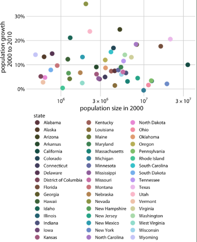

| Problem              | Impact                                                     | Fix                                                                                                     |
| -------------------- | ---------------------------------------------------------- | ------------------------------------------------------------------------------------------------------- |
| Use too many colours | Cluttered, hard to map the legend to the plot, distracting | Group states into regions (e.g., Northeast, Midwest, South, West) and colour by region instead of state |

Question 2:

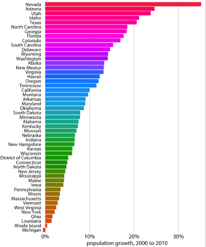

| Problem                  | Impact                                                                                 | Fix                                                                                                                                                                                                                  |
| ------------------------ | -------------------------------------------------------------------------------------- | -------------------------------------------------------------------------------------------------------------------------------------------------------------------------------------------------------------------- |
| Use rainbow colour scale | Non‑monotonic, misleading due to brightness fluctuations and non‑linear hue perception | Use a sequential colour scale (e.g., viridis) that maps intensity to value                                                                                                                                           |
| Too many categories      | Main message is not clear on first glance, overwhelming                                | Only show top k categories if the goal is to identify top performers; Or use accent colour to highlight the interested category and use muted colour for the rest if the goal is to compare one category to the rest |

Question 3:

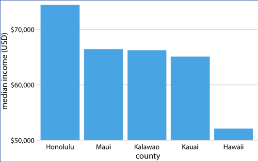

| Problem              | Impact                                              | Fix                                                              |
| -------------------- | --------------------------------------------------- | ---------------------------------------------------------------- |
| Baseline not at zero | Bar height is not proportional to value, misleading | Start y‑axis at zero; or use a dot plot if differences are small |

Question 4:

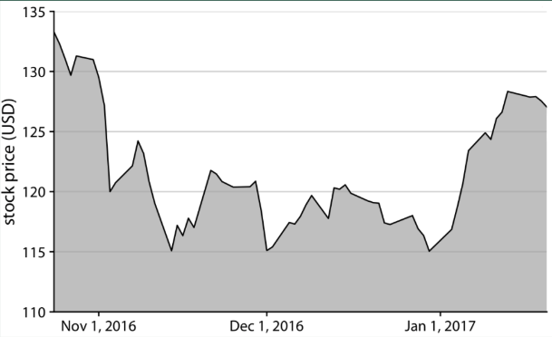

| Problem              | Impact                                                        | Fix                  |
| -------------------- | ------------------------------------------------------------- | -------------------- |
| Baseline not at zero | Area under the curve is not proportional to value, misleading | Start y‑axis at zero |

Question 5:

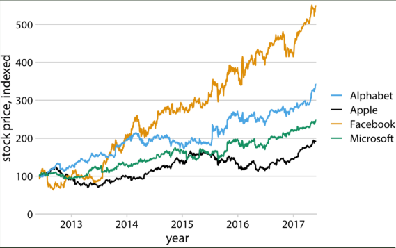

| Problem                                            | Impact                                                                                       | Fix                                                                                                    |
| -------------------------------------------------- | -------------------------------------------------------------------------------------------- | ------------------------------------------------------------------------------------------------------ |
| Legend is not ordered by final values of each line | Hard to match legend to lines, not CVD‑friendly, hard to distinguish if printed in grayscale | Order legend by final values, or directly label lines at the end of the plot instead of using a legend |

Question 6:

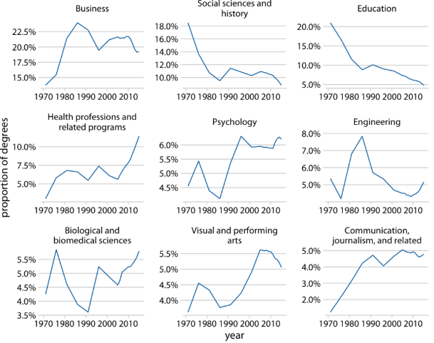

This is a **small multiples** figure.

| Problem                                  | Impact                                                                  | Fix                                                                           |
| ---------------------------------------- | ----------------------------------------------------------------------- | ----------------------------------------------------------------------------- |
| Inconsistent y‑axis scales across panels | Cannot compare values across panels, misleads about relative magnitudes | Use the same y‑axis scale for all panels to allow direct comparison of values |

Question 7:

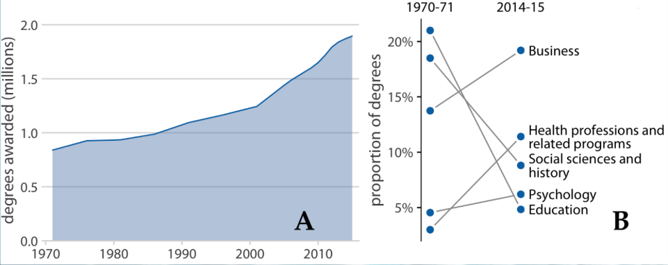

This is a **compound figure** with a line plot and a slope plot.

| Problem                                                                                                               | Impact                                                                     | Fix                                                                                                                                                                              |
| --------------------------------------------------------------------------------------------------------------------- | -------------------------------------------------------------------------- | -------------------------------------------------------------------------------------------------------------------------------------------------------------------------------- |
| The subtle panel labels is too large and bold, using different font from the axis labels, and placed in the plot area | Distracting, inconsistent with the rest of the figure, visually unpleasant | Use smaller, lighter font for panel labels; use the same font as axis labels; place panel labels outside the plot area (e.g., top left corner) to avoid cluttering the data area |

Question 8:

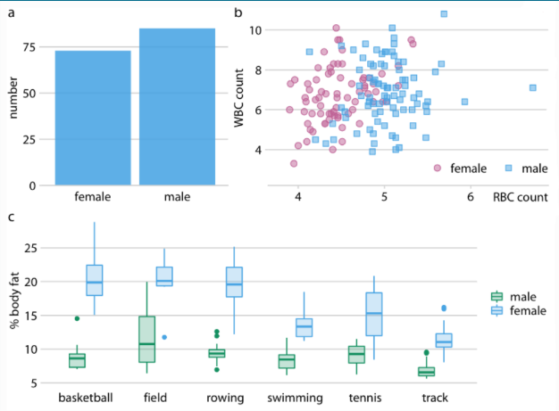

This is a **compound figure** with a bar chart, a scatter plot, and a grouped boxplot.

| Problem                                                                            | Impact                                                                                               | Fix                                                                                                                                |
| ---------------------------------------------------------------------------------- | ---------------------------------------------------------------------------------------------------- | ---------------------------------------------------------------------------------------------------------------------------------- |
| The color used to encode female and male is not consistent across the three panels | Audience need to spend extra effort to decode the colour scheme and relate the three panels together | Use the same colour scheme for all three panels (e.g., blue for male, pink for female), use only a single legend across all panels |

Question 9:

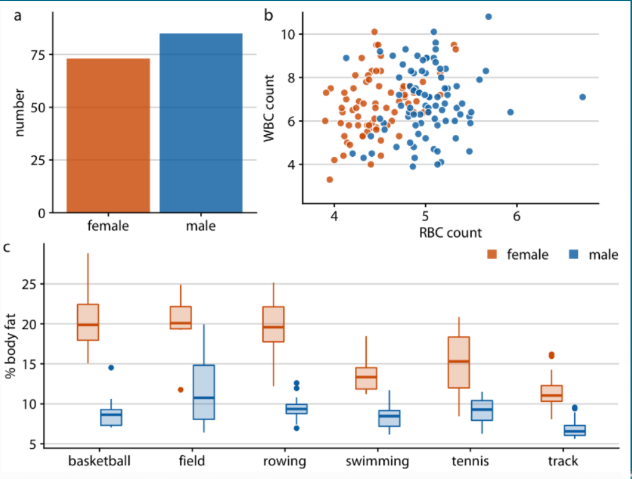

| Problem                       | Impact                                        | Fix                                                                |
| ----------------------------- | --------------------------------------------- | ------------------------------------------------------------------ |
| The axes are not aligned well | Technically correct, but visually unappealing | Align axes across panels for a cleaner, more professional look     |
| The axes lines are too thick  | Visually distracting, competes with data      | Use lighter, thinner lines for axes to let the data stand out more |

Question 10:

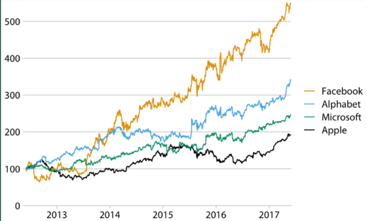

| Problem                | Impact                                                  | Fix                                                         |
| ---------------------- | ------------------------------------------------------- | ----------------------------------------------------------- |
| Y‑axis is not labelled | Unclear what the values represent, as well as the units | Add a clear y‑axis label with units, "Stock Price, Indexed" |

Question 11:

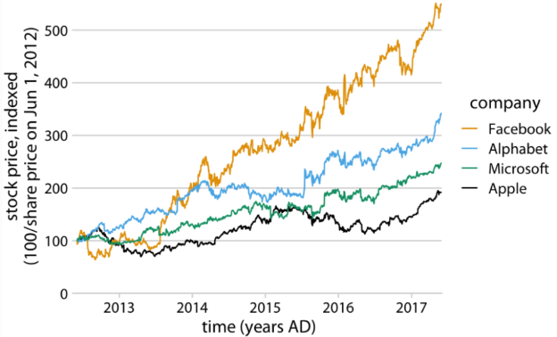

| Problem                     | Impact                                                              | Fix                                                                                                                                                                                           |
| --------------------------- | ------------------------------------------------------------------- | --------------------------------------------------------------------------------------------------------------------------------------------------------------------------------------------- |
| X-axis label is redundant   | Unnecessary, takes up space, adds visual clutter                    | Remove x-axis label "time (years AD)" since the tick labels already indicate the time in years AD, and the context of a line plot with time on the x-axis is clear enough without it.         |
| Y-axis label is too complex | Hard to understand at a glance, takes up space, adds visual clutter | Simplify y-axis label to "Stock Price, Indexed" to clearly indicate what the values represent. Add further explanation in the caption if needed, avoiding adding complexity to the plot area. |
| Legend label is redundant   | Unnecessary, takes up space, adds visual clutter                    | Remove legend label "Company" since the data (Facebook, Alphabet, Microsoft, Apple) is self-explanatory.                                                                                      |

Question 12:

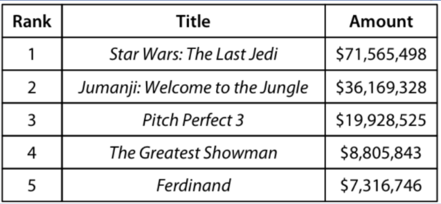

| Problem                                | Impact                             | Fix                                                                                                                  |
| -------------------------------------- | ---------------------------------- | -------------------------------------------------------------------------------------------------------------------- |
| Use vertical lines to separate columns | Visually cluttered, harder to read | Remove vertical lines                                                                                                |
| Use horizontal lines for every row     | Visually cluttered, harder to read | Use horizontal lines only to separate header row                                                                     |
| Data is not aligned properly           | Ugly, harder to read               | Left-align "Title" column; right-align "Amount" column (Rank has only single digits, so center-align is appropriate) |

Question 13:

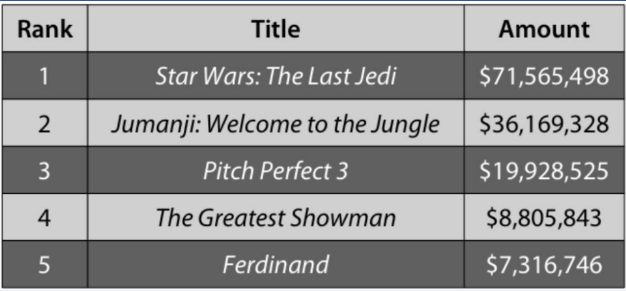

| Problem                                         | Impact                                            | Fix                                                                                                                  |
| ----------------------------------------------- | ------------------------------------------------- | -------------------------------------------------------------------------------------------------------------------- |
| Every problems in Q12                           | Refer to Q12                                      | Refer to Q12                                                                                                         |
| Using stripes with contrasting colours          | Visually distracting, competes with data          | Remove stripes, or use lower contrast colours for stripes (e.g., light grey and white) to make them less distracting |
| Header is not strongly differentiated from data | Hard to identify header row, visually unappealing | Use distinct colour for header row, match the color palette of the rest of the table                                 |

Question 14:

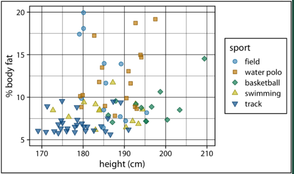

| Problem                          | Impact                                   | Fix                                                                                                         |
| -------------------------------- | ---------------------------------------- | ----------------------------------------------------------------------------------------------------------- |
| Lines are too thick and too much | Visually distracting, competes with data | Remove borders, remove subgrid, use lighter, thinner lines for the main grid to let the data stand out more |

Question 15:

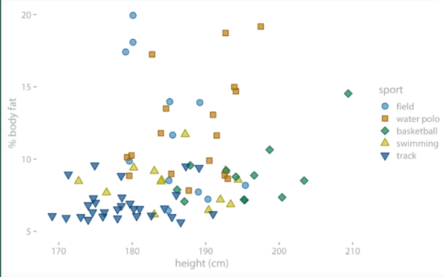

| Problem                  | Impact                                                                | Fix                                                                                                   |
| ------------------------ | --------------------------------------------------------------------- | ----------------------------------------------------------------------------------------------------- |
| Text colour is too light | Hard to read, especially for people with visual impairments           | Use a darker colour for text to improve readability, ensuring sufficient contrast with the background |
| No gridlines             | Hard to align data points with axes, harder to read values accurately | Add light gridlines to help guide the eye and improve readability without overwhelming the data       |

Question 16:

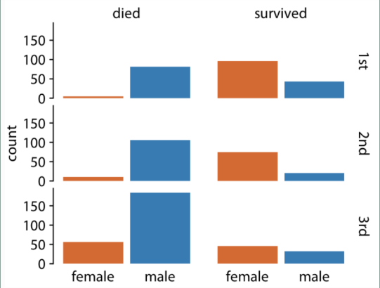

| Problem               | Impact                                                                                                                    | Fix                                                                                             |
| --------------------- | ------------------------------------------------------------------------------------------------------------------------- | ----------------------------------------------------------------------------------------------- |
| Facets are not framed | Harder to distinguish between different facets                                                                            | Add muted background colour to each facet to visually separate them                             |
| No gridlines          | Hard to align data points with axes, harder to read values accurately, does not imply the baseline and scale are the same | Add light gridlines to help guide the eye and improve readability without overwhelming the data |

Question 17:

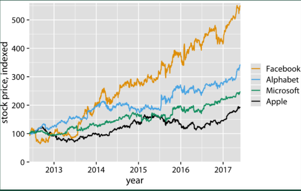

| Problem                  | Impact                                   | Fix                                                                                                                                                                             |
| ------------------------ | ---------------------------------------- | ------------------------------------------------------------------------------------------------------------------------------------------------------------------------------- |
| Gridlines overpower data | Visually distracting, competes with data | Remove vertical gridlines, only use light lines for horizontal gridlines, or use reference lines only (y=100) if the main purpose is to show the index relative to the baseline |

Question 18:

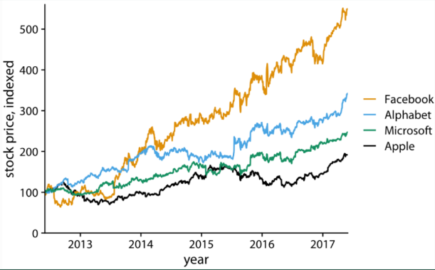

| Problem             | Impact                                                                                                     | Fix                                                                                                                                                                                                    |
| ------------------- | ---------------------------------------------------------------------------------------------------------- | ------------------------------------------------------------------------------------------------------------------------------------------------------------------------------------------------------ |
| No gridlines at all | Hard to align data points with axes, hard to understand how much deviation from the reference line (y=100) | Add light gridlines to help guide the eye and improve readability without overwhelming the data; or use reference lines only (y=100) if the main purpose is to show the index relative to the baseline |

Question 19:

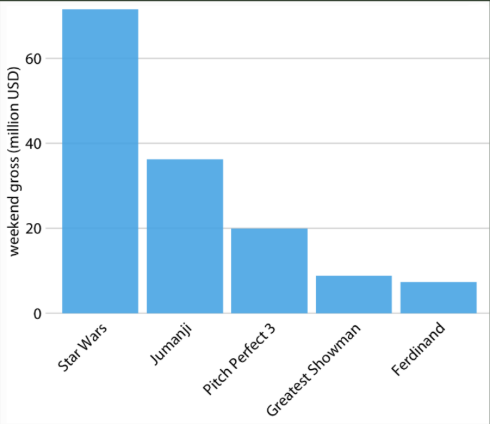

| Problem        | Impact                             | Fix                                                 |
| -------------- | ---------------------------------- | --------------------------------------------------- |
| Rotated labels | Hard to read, visually unappealing | Convert to horizontal bar chart with upright labels |

Question 20:

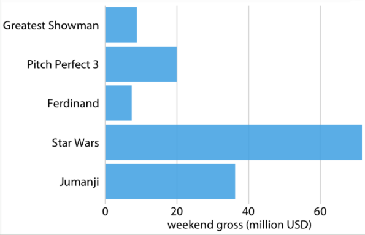

| Problem                      | Impact                                                                       | Fix                             |
| ---------------------------- | ---------------------------------------------------------------------------- | ------------------------------- |
| Bars are not sorted by value | Hard to identify relative magnitudes across categories, visually unappealing | Sort bars by value (descending) |

Question 21:

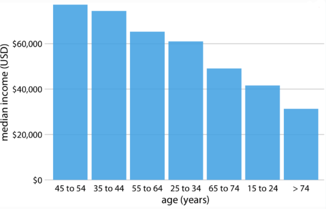

| Problem                          | Impact                                                                                             | Fix                    |
| -------------------------------- | -------------------------------------------------------------------------------------------------- | ---------------------- |
| Bars are not sorted by age group | Trends, patterns and anomalies (skewness, modality, outliers) are obscured, confusing to interpret | Sort bars by age group |

Question 22:

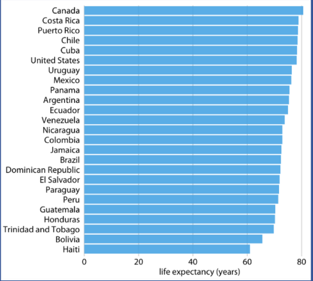

| Problem                           | Impact                                                                            | Fix                                                                          |
| --------------------------------- | --------------------------------------------------------------------------------- | ---------------------------------------------------------------------------- |
| Difference between bars are small | Main message is not clear on first glance, small differences are hard to perceive | Use a dot plot instead of a bar chart to show small differences more clearly |

Question 23:

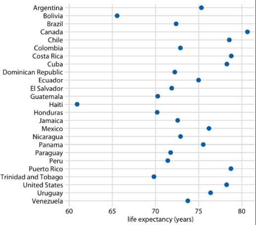

| Problem                      | Impact                                                                   | Fix                             |
| ---------------------------- | ------------------------------------------------------------------------ | ------------------------------- |
| Dots are not sorted by value | Form cloud of points, confusing to read and identify relative magnitudes | Sort dots by value (descending) |

Question 24:

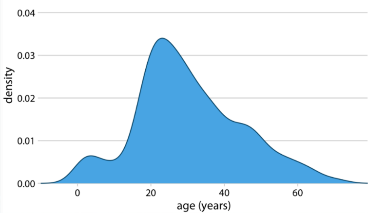

| Problem                                                     | Impact                                | Fix                                                                      |
| ----------------------------------------------------------- | ------------------------------------- | ------------------------------------------------------------------------ |
| The tail of the density plot is extended to negative values | Misleading, as age cannot be negative | Limit the x-axis range to only valid values according to the actual data |

Question 25:

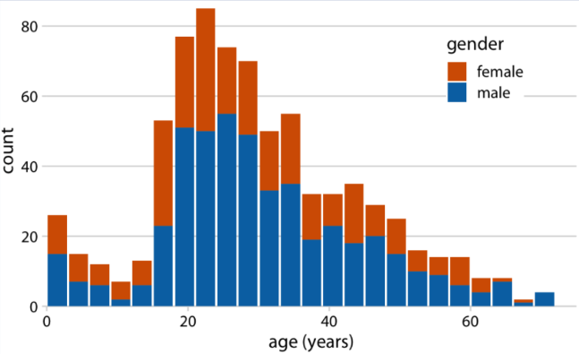

| Problem                                                         | Impact                                                                                                  | Fix                                                                                                                        |
| --------------------------------------------------------------- | ------------------------------------------------------------------------------------------------------- | -------------------------------------------------------------------------------------------------------------------------- |
| Using stacked bars for comparing distribution across categories | Height of the female category cannot be compared across categories, since they have different baselines | Use density plot, which has continuous lines to help separate the distributions, each group also sharing the same baseline |

Question 26:

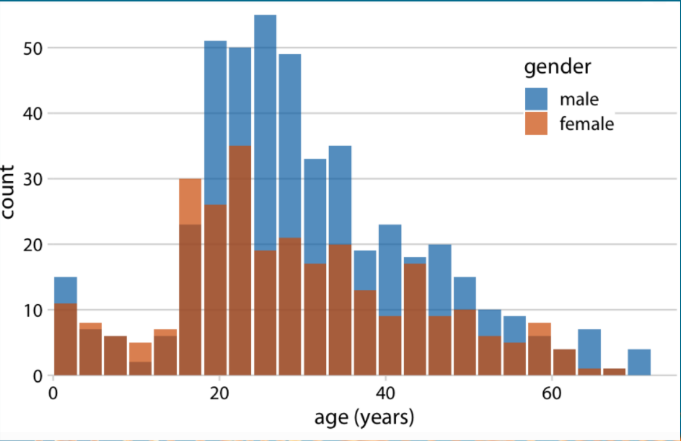

| Problem                                         | Impact                            | Fix                                                                                                                        |
| ----------------------------------------------- | --------------------------------- | -------------------------------------------------------------------------------------------------------------------------- |
| No visual cues to show blue bars starts at zero | Confusing to interpret the values | Use density plot, which has continuous lines to help separate the distributions, each group also sharing the same baseline |

Question 27:

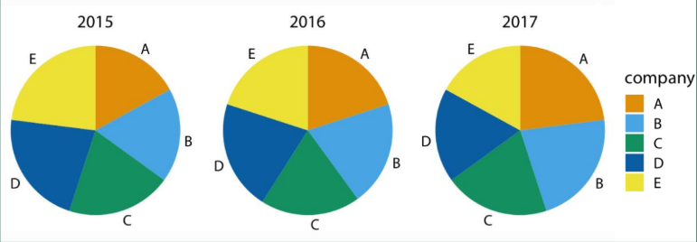

| Problem                                       | Impact                                                                                             | Fix                                                                                                                                                 |
| --------------------------------------------- | -------------------------------------------------------------------------------------------------- | --------------------------------------------------------------------------------------------------------------------------------------------------- |
| Hard to compare slices across different years | Slices is not intuitive to compare size with small differences, each slices has different baseline | Use grouped bar chart, which allows direct comparison of the size of each category across different years, with a shared baseline for each category |
