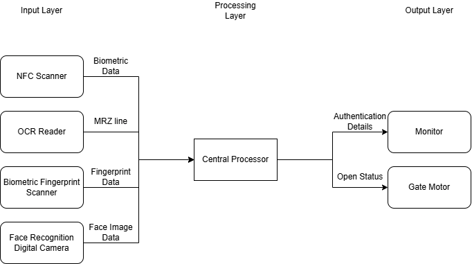
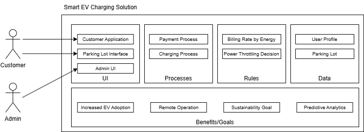

# 2025 October Exam

## Question 1

a)

- **Identity**: Each IoT device are uniquely identifiable, allowing them to be distinguished from one another. For example, a bus GPS tracker can be identified by its unique ID, enabling it to be tracked and monitored in real-time from a central administration system.
- **Intelligence**: IoT devices are equipped with processing capabilities that enable them to analyze data, make decisions, and perform actions autonomously. For example, a smart camera can perform facial recognition to identify individuals and trigger specific actions, such as unlocking a door or sending an alert.
- **Communication**: IoT devices can communicate with each other and with central systems within a connected network. For example, smart traffic lights system like Stars can communicate with each other to optimize traffic flow, adjusting their signals based on real-time traffic conditions.

b)

- **Device-to-Device Communication**: In this model, IoT devices can communicate directly with each other without the need for a central server or intermediary. The devices can establish a peer-to-peer connection, allowing data to be exchanged directly between them. For example, in a smart home setup, a smart thermostat can communicate directly with a smart light bulb to adjust the lighting based on the temperature settings.
- **Device-to-Gateway Communication**: In this model, IoT devices connect to a local gateway, which acts as an intermediary between the devices and the cloud. The gateway collects data from the devices, processes it locally, and then sends relevant information to the cloud for further analysis and storage. This model balances between device-to-device communication and device-to-cloud communication, allowing for more sophisticated processing than performed on the end devices, while being faster than cloud communication as the gateway is closer to the devices. For example, in a smart city application, sensors on streetlights can communicate with a local gateway that processes the data and sends relevant information to a central system for traffic management.

c)

- **Threat of New Entrants**: The IoT ecosystem can lower the barriers to entry for new companies, as the IoT technology becomes more accessible and affordable. This can lead to increased competition in the market, as new players can easily enter and offer innovative IoT solutions. These new entrants can challenge established companies and disrupt traditional industries, leading to a more dynamic and competitive market.
- **Bargaining Power of Suppliers**: The IoT ecosystem can increase the bargaining power of suppliers, as the demand for IoT components and technologies grows. As IoT devices grow in popularity, suppliers of IoT hardware, software, and services may have more leverage in negotiations with companies that rely on their products. This can lead to higher costs for companies that need to source IoT components, which can impact their profitability and competitiveness in the market. Additionally, the reliance on specific suppliers for critical IoT components can create vulnerabilities in the supply chain, further increasing the bargaining power of suppliers.

d)

- **Monitoring**: IoT solutions enable real-time monitoring of various processes and systems through the use of sensors and connected devices. This allows for continuous data collection and analysis, providing insights into the performance and status of processes. For example, in a manufacturing setting, IoT sensors can monitor equipment performance, detect anomalies, and predict maintenance needs, leading to improved efficiency and reduced downtime.

## Question 2

a)



b)

- The encrypted biometric data is read by the NFC reader, while MRZ data is read by the OCR reader. Both sets of data are then sent to the central processing unit for decryption and verification.
- The central processing unit will validate the digital certificate to ensure that the biometric data is authentic and has not been tampered with. If the certificate is valid, the central processing unit will proceed to compare the biometric data against the stored data for authentication.
- The biometric fingerprint scanner captures the fingerprint data, which is sent to the central processing unit for comparison against the stored biometric data.
- The facial recognition digital camera captures the facial image, which is also sent to the central processing unit for comparison against the stored biometric data.
- After the central processing unit verifies the biometric data against the stored data, it sends the verification result to the display screen, which shows whether the authentication was successful or not.
- If the authentication is successful, the central processing unit can also send a signal to the gate motor to open the gate, allowing the passport holder to pass through.

c)

i) Core Platform Layer

ii)

- The ePassport solution can validate whether the passport holder has a valid visa for the destination country. This can be done by integrating the ePassport system with a cloud-based visa database, allowing for real-time verification of visa status during the authentication process. This feature can enhance border security by ensuring that only individuals with valid visas are allowed entry into the country.
- The ePassport solution can also provide real-time analytics and reporting on passport usage and authentication attempts. This can be achieved by storing authentication data in the cloud and using data analytics tools to generate insights on passport usage patterns, potential security threats, and traffic flow at border control points. This information can help authorities make informed decisions and improve the efficiency of border control operations.

iii)

- Device Layer
- This is the bottommost layer which includes the physical components of IoT solution.
- The physical components are roughly categorized into three groups: sensors, actuators, and controllers.
- Sensors are responsible for collecting data from the environment, such as biometric data from the passport holder.
- Actuators are responsible for performing actions according to the commands received from the central processing unit, such as opening the gate.
- Controllers are central processing units that manage the data flow and decision-making processes within the IoT solution, such as validating the biometric data and controlling the display screen.

## Question 3

a)

i)

- Publisher is a component in the MQTT protocol that is responsible for streaming data to the MQTT broker. For example, a temperature sensor can act as a publisher by sending temperature readings to the MQTT broker.
- Broker is a central component in the MQTT protocol that receives messages from publishers and distributes them to subscribers. For example, an MQTT broker can receive temperature readings from multiple sensors and distribute them to subscribers interested in that data.
- Subscriber is a component in the MQTT protocol that receives messages from the MQTT broker. For example, a mobile application can act as a subscriber by receiving temperature readings from the MQTT broker and displaying them to the user.

ii)

- Topics is used in MQTT to categorize messages. It helps to abstract and isolate the producer and consumer of the data, so producers and consumers do not need to know about each other, reducing coupling and increasing flexibility.
- For example, a temperature sensor can publish its readings to a topic called "home/temperature", and any subscriber interested in temperature data can subscribe to that topic to receive the readings.
- The subscriber does not need to concern with the publisher's identity or location to receive the data, while the publisher does not need to know who the subscribers that are interested in its data.

b)

i)

- Lines 51-53 is a for loop used inside a callback function that triggers when a message is received on a subscribed MQTT topic.
- It convert the incoming MQTT byte array into a string, enabling the program to interpret binary data as readable string. This reconstruction allows the code to compare the message against predefined commands (e.g., "led1=ON") to execute actions.
- It reconstructs the MQTT message by casting each byte of the incoming message to a character and appending it to the `mqtt_command` string.

ii)

- It will cause the mqtt setup to fail, interrupting the operation of this device.
- WiFi connection should be established before setting up the MQTT connection, as the MQTT connection relies on an active internet connection to establish communication with the MQTT broker.
- If the MQTT setup is attempted before the WiFi connection is established, the device will not be able to connect to the MQTT broker, resulting in a failure to set up the MQTT connection and preventing the device from sending or receiving messages through MQTT.

iii)

- new code location place between line 72 and line 73

```cpp
else if (command_status1 == 0) {
    digitalWrite(LED1_PIN, 0);
}
```

## Question 4

a)

- **Market Opportunities** is the potential demand for a product or service in a specific market. For a smart EV Charging Station solution, the market opportunities are significant due to the increasing adoption of electric vehicles. In addition, an IoT powered EV charging station can provide additional services such as smart energy management, remote monitoring, and predictive maintenance, which makes it competitive in the demanding market.
- **Time-to-Market/Channel** refers to the time it takes for a product to be developed and made available to customers, as well as the channels through which it is distributed. For a smart EV Charging Station solution, the time-to-market can be shortened by leveraging existing IoT technologies and platforms, due to the maturity of IoT solutions in the market, which can accelerate the development process. The distribution channels for such a solution also contributes to the time-to-market, choosing the right channels, such as partnerships with property developers, businesses, and government agencies, can facilitate faster adoption and deployment of the solution.

b)



c)

- **Analytics**: The analytics component of the IoT platform can be used to process and analyze the data collected from the EV charging stations. This can include data on energy consumption, charging patterns, and user behavior, which can support intelligent energy management and optimised revenue generation, such as identifying peak usage times and adjusting pricing accordingly.
- **Processing & action management**: This component can be used to perform real-time processing of data and manage actions based on predefined rules and sensor data. For example, it can calculate the billing for each charging session based on energy consumption, and automatically trigger actions such as sending notifications to users when their charging session is complete or when there are issues with the charging station.

d)

- One potential issue of autonomous and unpredictable behavior. Autonomous and unpredictable behavior indicates the IoT devices can make decisions based on real-time data, which can lead to less deterministic outcomes. For example, if the smart EV charging station is designed to automatically adjust its charging rates based on real-time energy demand and supply, it may unpredictably increase the charging rates during peak hours to manage energy consumption. This could lead to customer dissatisfaction if they are not aware of the rate changes or if the rate increases significantly, making it unaffordable for some users. Without proper rules and safeguards in place, the autonomous behavior of the charging station could lead to unintended consequences, such as overcharging customers and creating a negative user experience.
