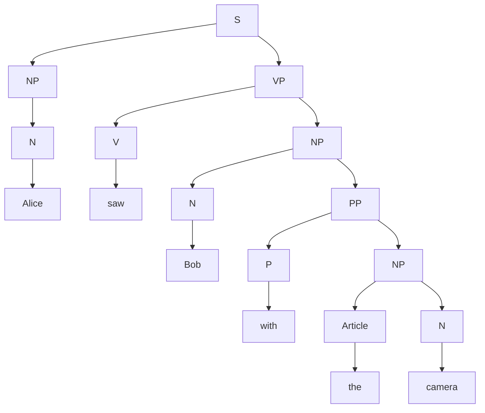

# 2025 OCT Exam

- [2025 OCT Exam](#2025-oct-exam)
  - [Question 1](#question-1)
  - [Question 2](#question-2)
  - [Question 3](#question-3)
  - [Question 4](#question-4)

## Question 1

a) For an example sentence, "The movie was not good", tokenisation breaks the sentence into individual words or tokens, such as ["The", "movie", "was", "not", "good"]. This technique plays the role of breaking down the text into smaller and manageable units. This is important for control dictionary size, as it allows further processing such as stemming, lemmatization, and stop-word removal to be applied to each token. 

b)

| No  | Issue                   | ONE(1) example from dataset                                                                                   | Proposed Solution                                                                   |
| --- | ----------------------- | ------------------------------------------------------------------------------------------------------------- | ----------------------------------------------------------------------------------- |
| 1   | Emojis and Emoticons    | Oh k...i'm watching here:)                                                                                    | Oh k...i'm watching here happy                                                      |
| 2   | Slang and Abbreviations | U dun say so early hor... U c already then say...                                                             | You do not say so early ... You see already then say...                             |
| 3   | Capitalization          | I HAVE A DATE ON SUNDAY WITH WILL!!                                                                           | i have a date on sunday with will!!                                                 |
| 4   | Punctuation             | Ok lar... Joking wif u oni...                                                                                 | Ok lar Joking wif u oni                                                             |
| 5   | Stop words              | I'm gonna be home soon and i don't want to talk about this stuff anymore tonight, k? I've cried enough today. | gonna home soon don't want talk stuff stuff anymore tonight, k? cried enough today. |

## Question 2

a)

- SRL is used to describe how each participant in a sentence is related to the action, which helps to identify what is in an event described by the sentence.

  | Word         | Role       |
  | ------------ | ---------- |
  | Mary         | Agent      |
  | loaded       | Predicate  |
  | truck        | Theme      |
  | hay          | Instrument |
  | at the depot | Location   |
  | Friday       | Time       |

## Question 3

a)

b)

i) 2

ii)

- V - PP - DET - N
- N - PP - DET - N

iii)

- V - PP - DET - N
  - Initial probability: $0.5$
  - Emission: $0.3 \times 0.6 \times 0.9 \times 0.25 = 0.0405$
  - Transition: $0.32 \times 0.77 \times 0.84 = 0.206976$
  - Total: $0.5 \times 0.0405 \times 0.206976 = 0.004191264$
- N - PP - DET - N
  - Initial probability: $0.4$
  - Emission: $0.2 \times 0.6 \times 0.9 \times 0.25 = 0.027$
  - Transition: $0.27 \times 0.77 \times 0.84 = 0.174636$
  - Total: $0.4 \times 0.027 \times 0.174636 = 0.0018860688$
- V - PP - DET - N is the most likely sequence of PoS tags for the sentence "bark at the tree." with a probability of $0.004191264$.

iv) Verb, V

## Question 4

Total number of documents: 3

| Term     | DF  | IDF      |
| -------- | --- | -------- |
| malaysia | 2   | 0.176091 |
| pride    | 1   | 0.477121 |
| champion | 2   | 0.176091 |
| games    | 2   | 0.176091 |
| gold     | 2   | 0.176091 |
| olympic  | 2   | 0.176091 |

TF:

| Text       | Malaysia | Pride | Champion | Games | Gold | Olympic |
| ---------- | -------- | ----- | -------- | ----- | ---- | ------- |
| Document 1 | 1        | 1     | 3        | 0     | 0    | 0       |
| Document 2 | 1        | 0     | 1        | 1     | 1    | 1       |
| Document 3 | 0        | 0     | 0        | 1     | 1    | 1       |
| Query      | 1        | 0     | 0        | 0     | 0    | 1       |

TF-IDF:

| Text       | Malaysia | Pride    | Champion | Games    | Gold     | Olympic  |
| ---------- | -------- | -------- | -------- | -------- | -------- | -------- |
| Document 1 | 0.176091 | 0.477121 | 0.528274 | 0        | 0        | 0        |
| Document 2 | 0.176091 | 0        | 0.176091 | 0.176091 | 0.176091 | 0.176091 |
| Document 3 | 0        | 0        | 0        | 0.176091 | 0.176091 | 0.176091 |
| Query      | 0.176091 | 0        | 0        | 0        | 0        | 0.176091 |

- Cosine Similarity:
  - Magnitude of Query:
    $$\sqrt{0.176091^2 + 0^2 + 0^2 + 0^2 + 0^2 + 0.176091^2}$$
    $$= 0.249030$$
  - Query and Document 1:
    - Dot Product:
      $$0.176091 \times 0.176091 + 0 \times 0.477121 + 0 \times 0.528274 + 0 \times 0 + 0 \times 0 + 0.176091 \times 0$$
      $$ = 0.031008$$
    - Magnitude of Document 1:
      $$\sqrt{0.176091^2 + 0.477121^2 + 0.528274^2 + 0^2 + 0^2 + 0^2}$$
      $$= 0.733298$$
    - Cosine Similarity:
      $$\frac{0.031008}{0.249030 \times 0.733298} = 0.169802$$
  - Query and Document 2:
    - Dot Product:
      $$0.176091 \times 0.176091 + 0 \times 0 + 0 \times 0.176091 + 0 \times 0.176091 + 0 \times 0.176091 + 0.176091 \times 0.176091$$
      $$= 0.062016$$
    - Magnitude of Document 2:
      $$\sqrt{0.176091^2 + 0^2 + 0.176091^2 + 0.176091^2 + 0.176091^2 + 0.176091^2}$$
      $$= 0.393751$$
    - Cosine Similarity:
      $$\frac{0.062016}{0.249030 \times 0.393751} = 0.632456$$
  - Query and Document 3:
    - Dot Product:
      $$0.176091 \times 0 + 0 \times 0 + 0 \times 0 + 0 \times 0.176091 + 0 \times 0.176091 + 0.176091 \times 0.176091$$
      $$= 0.031008$$
    - Magnitude of Document 3:
      $$\sqrt{0^2 + 0^2 + 0^2 + 0.176091^2 + 0.176091^2 + 0.176091^2}$$
      $$= 0.304999$$
    - Cosine Similarity:
      $$\frac{0.031008}{0.249030 \times 0.304999} = 0.408248$$

**Document 2 has the highest cosine similarity with the query, with a value of 0.632456. Therefore, Document 2 is the most relevant document to the query.**